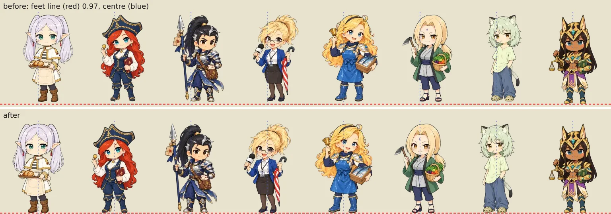
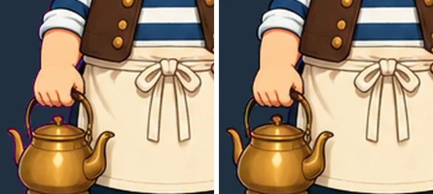
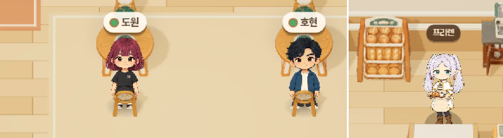
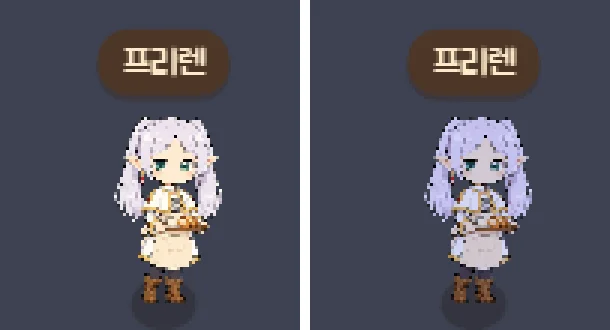
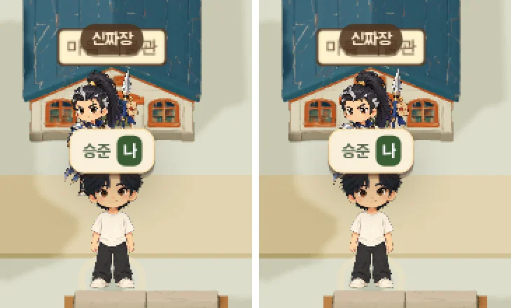
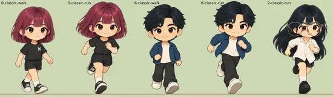
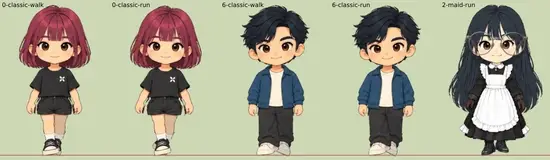
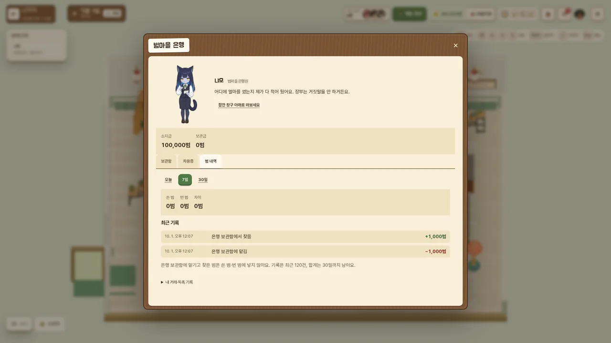

# 캐릭터 도트·모델 점검 (2026-10-01)

오늘 큰 변경(어디서나 시장 거리 카메라, 주민 chibi 스프라이트, 새 실내·가게 실내, 새 방 v2, 말풍선 초상화) 뒤에
캐릭터 그림이 깨진 곳이 없는지 확인한 기록입니다. 브랜치 `claude/character-qa`.

## 어떻게 봤나

| 범위 | 방법 | 결과 |
| --- | --- | --- |
| 모든 캐릭터 이미지 (주민 chibi 17, 대화용 전신 17, 초상 17, 호스트 시트 5, 친구 걷기/달리기 시트 7, 로그인 7) | 픽셀 스캔: 실루엣 가장자리의 마젠타·초록 키 색, 프레임/칸에 잘린 그림, 발 위치·중앙 정렬 | 문제 2건 (chibi 발선, 호스트 테두리), 고침 |
| 친구 7명 × 모든 의상 (도원 만두머리 포함 45벌) × 대기·걷기 6·달리기 6 = 585 프레임 | 게임의 실제 `loungeSprites`로 캔버스에 그려 측정 (`.qa` 하네스) | 잘림·키 색 없음, 발 위치 일정. 도원 와이드팬츠/데님의 분홍 픽셀은 손톱 색(원래 그림) |
| 3D 모델 135개 (kArchive/CC0 GLB) | 재질 없음, 노멀 없음/0/NaN, UV 없는 텍스처, 빈 이미지 검사 | 이상 없음 |
| 실제 화면 1920×1080 낮 14:00 | district-shots `--residents --shops`: 광장, 시장 거리, 항구, 언덕, 농협·잡화점·빵집·어시장 (문 앞·계산대·창) | 아래 표 |
| 공공 실내 (회관·카지노·주점·은행·미용실) | interior-shots `--seated` | 아래 표 |
| 새 방 v2 · 모델하우스 (도원의 방 등) · 가구점 | rooms-shots | 이상 없음 |
| 말풍선 (친구·주민) 1920×1080 / 1280×720 | talk-shots | 이상 없음, 글자 측정 0건 |
| 대화용 전신 22명 (말풍선 2:3 틀 그대로 자른 모습) | 정적 합성 | 이상 없음 |
| 밤 21:30 · 1280×720 | district-shots `--view s --at 21:30` (광장·시장 거리) | 문제 1건 (주민 밤 색조), 고침 |

## 결과표

| 캐릭터 | 장면 | 문제 | 상태 |
| --- | --- | --- | --- |
| 프리렌·로제·신짜장·잔나·럭스·츠나데·야니네코 (chibi) | 광장·시장 거리·가게·실내 등 주민이 서는 모든 곳 | 발이 친구 발선(97%)보다 2~3% 위에 떠 있고, 몸이 캔버스 폭의 8~13%만큼 오른쪽으로 치우치고 다른 주민보다 2~3% 작았음. 원본 생성 이미지 왼쪽 아래 구석의 불투명 점 몇 개를 슬라이서가 그림의 일부로 셈 | **고침**: `scripts/optimize-assets.mjs`의 `opaqueBox`가 400px 이상 이어진 조각만 셈 → 17명 모두 높이 94%, 발 97%, 중앙. 프리렌 캔버스 514→512 (`lounge-npc-chibi.ts`) |
| 허 선장 (주점), 문 사장 (부동산), 결 목수 (가구점) | 주점 바 뒤, 가게 창의 둥근 얼굴, 말풍선 전신 | 머리카락·손·주전자·의자 둘레에 분홍(마젠타) 테두리 2,000~3,700px | **고침**: `optimize-assets.mjs hosts` 모드가 투명 가장자리 6px 안의 마젠타 기운을 풀어내고(unmix+despill) WebP 재인코딩. 남은 키 색 0~7px |
| 루미·매화 (카지노·회관) | 테이블 뒤 | 없음 (시트 6칸 모두 발선 647px, 칸 안) | 확인 |
| 로제·냐모·그웬 (카지노·은행·미용실 카운터) | 카운터 뒤 | 없음 | 확인 |
| 나세라 (농협), 쓰레쉬 (잡화점), 프리렌·힘멜 (빵집), 럭스 (어시장) | 가게 계산대 뒤 | 계산대가 다리를 가림 (뒤에 서 있으니 정상) | 확인 |
| 친구 (빵집 카페 앞쪽 의자) | 빵집 실내 | 앞쪽 의자는 등받이가 카메라 쪽이라, 앞을 보는 친구 그림 위로 의자가 겹쳐 "의자 뒤에 선" 것처럼 보임. 뒷모습 그림이 없어서 생기는 설계상 한계 | **남음**: 아트 필요 (앉은/뒷모습 포즈). 아래 스크린샷 |
| 쓰레쉬 | 어디서나 | 초록 도깨비불 테두리: 의도된 그림 (키 색 아님) | 확인 |
| 나세라 | 말풍선 전신·초상 | 투구 귀 끝이 틀 위로 살짝 잘림 (자르기 위치) | 남음 (사소, 원하면 `NPC_PORTRAITS.nasera.top` 조정) |
| 주민 chibi 전원 | 밤·저녁의 광장·시장 거리·항구·언덕 | 친구 그림은 가로등이 켜지면 밤 색으로 어두워지는데, 주민 chibi만 낮 밝기 그대로 어두운 길 위에 떠 보였음 (`ResidentLayer`에 색조가 안 들어감) | **고침**: `ResidentLayer.setTint` 추가, 광장(`lounge-village.tsx`)·구역(`lounge-area-3d.tsx`)이 친구와 같은 `villageFigureTint`를 넘김. 실내는 원래 `tint` 옵션으로 맞음 |
| 친구 7명 전 의상 | 광장·시장·항구·언덕·실내 | 없음 | 확인 |
| 신짜장 (박물관 앞) | 광장 | 다리가 안 보이는 것처럼 보였으나 내 이름표(HTML)에 가려진 것 | 확인 (버그 아님) |
| 3D 모델 전체 | 전 장면 | 없음 | 확인 |
| (도구) talk-shots | — | 프리렌 밤 일정이 시장 거리로 바뀌어 22:05 기본값이 실패 | **고침**: 프리렌이 마을에 있는 시각을 스스로 찾음 |

## 전/후

- 주민 chibi 발선 (빨간 점선 = 친구 발선 97%, 파란 점선 = 가운데, 맨 오른쪽 나세라는 원래 맞던 기준):
  
- 전체 chibi: [전](img/character-qa/chibi-all-before.webp) / [후](img/character-qa/chibi-all-after.webp)
- 호스트 테두리 (왼쪽 전, 오른쪽 후):
  
  
  
- 호스트 시트 전체 (후): [hosts-all-after](img/character-qa/hosts-all-after.webp)

## 장면 기록 (수정 후 빌드)

- 광장 주민 (낮): [hub-residents-day](img/character-qa/hub-residents-day.webp)
- 가게 실내 (잡화점·빵집 문/계산대·어시장): [shop-interiors-day](img/character-qa/shop-interiors-day.webp)
- 빵집 앞쪽 의자에 앉은 친구 (남은 문제): 
- 공공 실내: [카지노·회관](img/character-qa/interiors-casino-hall.webp) · [주점·은행·미용실](img/character-qa/interiors-tavern-bank-salon.webp)
- 항구·언덕: [districts-harbor-hillside](img/character-qa/districts-harbor-hillside.webp)
- 새 방·모델하우스·부동산/가구점 창: [rooms-modelhouse](img/character-qa/rooms-modelhouse.webp)
- 말풍선 (프리렌): [talk-frieren-fhd](img/character-qa/talk-frieren-fhd.webp) · 전원의 말풍선 전신: [speech-box-figures](img/character-qa/speech-box-figures.webp)
- 친구 7명 × 전 의상 × 대기/걷기/달리기 (빨간 선 = 발선 97%): [friends-outfits-frames](img/character-qa/friends-outfits-frames.webp)
- 밤 21:30 · 1280×720 (주민 색조 수정 후): [night-720-hub-market](img/character-qa/night-720-hub-market.webp)
- 밤 주민 색조 (왼쪽 전, 오른쪽 후): 
- 광장 신짜장 (왼쪽 수정 전 빌드, 오른쪽 후: 조금 작고 오른쪽으로 치우쳤던 것이 친구와 같은 크기로): 

## 걷기·달리기 (스타듀밸리식으로)

사용자 요청: "스타듀밸리 같은 게임처럼 걸었으면". 24프레임(2주기)씩 그려 머리 위치를 쟀습니다 (캔버스 220×320, 몸 키 약 300px).

| | 수정 전 | 수정 후 |
| --- | --- | --- |
| 기본 의상(우리다운 하루) 걷기 | 손그림 6장: 정면↔3/4 시점이 섞이고 머리가 좌우 4~11px, 위아래 3~10px 흔들림 | 머리 좌우 0px, 위아래 1~2px |
| 기본 의상 달리기 | 손그림 6장: 3·6번째가 웅크린 포즈라 머리가 20~54px(키의 10~18%) 출렁, 좌우 4~19px | 1~2px |
| 다른 의상(리그) 달리기 | 한 포즈에서만 6~10px 툭 뛰어오름, 다리가 A자로 크게 벌어짐, 정면 그림이 옆으로 기울어짐 | 뜀 없음, 짧은 보폭, 거의 똑바로 |

- `app/lounge-rig-frames.ts` `HAND_DRAWN_CLASSIC = false`: 기본 의상도 다른 의상과 같은 리그로 걷습니다 (손그림 시트 파일은 남겨 둠, 되돌리기 쉬움).
- `app/lounge-gait.ts` `GAIT_STYLES`: 걷기 허벅지 18°→12°, 무릎 44°→30°, 기울임 1.5°→0 / 달리기 23°→15°, 55°→38°, 기울임 6°→1°, 공중 뜀 0.03→0. 발걸음마다 1~2px 통통, 달리기는 같은 걸음을 더 빠르게.
- 테스트 `tests/lounge-gait.test.mjs`: 달리기도 공중에 뜨지 않음, 통통 높이 4% 미만.

 
프레임 나열: [전](img/character-qa/walk-before.webp) / [후](img/character-qa/walk-after.webp)

남은 것: 친구 그림은 정면 한 방향뿐이라 스타듀밸리처럼 위·아래·옆 4방향 걷기는 새 그림(방향별 걷기 시트)이 있어야 합니다.

## 은행 "범 내역" 탭 (사용자 요청 추가)

"범을 은행에서 어디에 얼마나 썼는지 확인" → 범마을 은행 창구(냐모)에 세 번째 탭 **범 내역**.

- `app/lounge-money-log.ts`: 서버(`cloudTransition`)가 명령마다 원장 전/후를 비교해 지갑마다 한 줄씩 적습니다.
  - 원장 지급/지출 항목은 사유 이름으로 적습니다 (예: `상점: 파스텔 팔레트`, `빵집 음식`, `토마토 판매`).
  - 테이블 게임은 `○○ 판돈` / `○○ 정산`으로 적습니다.
  - 보관함은 `은행 보관함에 맡김/찾음`으로 적고, 쓴 범·번 범 합계에서는 뺍니다.
  - 그 밖의 변화는 명령 이름으로 적습니다 (친구 사이 대출, 카지노 대출, 도둑질·벌금, 연체 회수).
- 친구마다 최근 120줄과 분류별 하루 합계 30일치를 `world.moneyLog`에 둡니다. 한 사람에 12KB를 넘지 않습니다.
- 화면: 오늘/7일/30일 쓴 범·번 범, 분류별 막대(음식·가게 물건·집·가구·농사·도구·마을 기부·테이블 게임·은행·대출·친구와 주고받음), 최근 기록 60줄.
- 테스트 `tests/lounge-money-log.test.mjs`. village-life 검증은 탭 3개와 맡김/찾음 기록을 확인합니다.
- 기록은 배포 뒤부터 쌓입니다. 예전 지출은 남아 있지 않아 되살릴 수 없습니다.

## 자동 검사

`tests/lounge-character-pixels.test.mjs` (`npm test`에 포함, 약 3초, sharp로 디코딩):

- 주민·호스트·`LOUNGE_ASSETS`가 가리키는 파일이 모두 있는지
- chibi 17명: 캔버스 크기 = `NPC_CHIBI`, 높이 94%±1%, 발 97%±0.6%, 가운데±2%, 캔버스 가장자리에 닿지 않음, 마젠타(베아트리스·봇치는 초록) 테두리 ≤20px
- 호스트 시트 5장: 6칸 모두 발 647px±3, 칸 안, 키 600px의 95% 이상, 마젠타 테두리 ≤40px
- 대화용 전신·초상·로그인: 마젠타 테두리 ≤20px, 전신이 캔버스에 잘리지 않음, 발 위치 = `art.foot`±1.2%
- 친구 걷기/달리기 시트 7장: 12포즈 모두 칸 안, 너무 작지 않음, 발선 ±2px

수정 전 에셋으로 돌리면 `frieren soles at 0.947…`, `captain sheet has a magenta rim (2110 px)`로 실패합니다.

## 다시 만들기

- chibi: `node scripts/optimize-assets.mjs chibi` (원본 `public/assets/lounge/_originals/chibi/`)
- 호스트 시트: `node scripts/optimize-assets.mjs hosts` (원본 PNG는 그대로, WebP만 보정)

새 그림은 만들지 않았습니다 (Higgsfield 크레딧 사용 없음).

## 다시 그려야 할 것 (남은 것)

1. **빵집 앞쪽 의자에 앉은 친구**: 친구 그림은 정면뿐이라, 테이블을 보고 앉는 앞쪽 의자에서는 등받이가 그림 앞에 겹칩니다.
   앉은 뒷모습(또는 앉은 정면 + 의자 방향 반대로 배치) 포즈가 있어야 자연스럽습니다. 지금은 게임 동작에는 지장 없음.
2. 나세라 말풍선 틀에서 투구 귀 끝이 몇 px 잘림 (선택 사항).
