# 범타듀 밸리 — 맵 확장과 테크트리 설계서

- 요청(원문): "맵에 확장하거나 테크트리를 찍을 수 있을 수 있게 해줘. 스타듀밸리나 다른 비슷한 농장경영류 게임을 참고해서, 설계부터 해봐"
- 작성일: 2026-09-26. 저장소 파일은 수정하지 않았고, git도 쓰지 않았습니다.
- 근거로 삼은 것:
  - 코드: `app/lounge-life.ts`, `lounge-life-plus.ts`, `lounge-items.ts`, `lounge-calendar.ts`, `lounge-economy.ts`, `lounge-village-layout.ts`(+`-spots`, `-waters`, `-valley`, `-karchive-layout`), `lounge-interior-layout.ts`, `lounge-cloud-room.ts`, `lounge-keybinds.ts`
  - 문서: `scratchpad/audit2/design.md`, `karchive-candidates.md`, `karchive-village-expansion.md`, `kcatalog.json`(6,691개)
  - 시뮬레이션: 실제 엔진으로 도는 120일 시뮬레이션 `econ/sim-after.mjs`를 다시 돌렸습니다. 활동량을 뽑아내도록 고친 사본은 `tech/sim-base.mjs`, 결과는 `tech/sim-base.json`입니다. 이 활동량 위에 이번 설계를 얹은 모델이 `tech/tree-sim.mjs`이고, 결과는 `tech/tree-*.json`입니다.
- 모든 수치는 **첫 제안값**입니다. 구현하면서 실제 엔진 시뮬레이션으로 다시 맞춰야 합니다(§6-5).

---

## 0. 한 장 요약

| 항목 | 추천 |
|---|---|
| 구조 | **세 줄로 자라는 성장**: ① 개인 기술(5종 × 10레벨, 5·10레벨에 전문가 선택) ② 대장간 도구(5종 × 5단계) ③ 공유 **마을 개척 연구**(9개 프로젝트가 새 지역을 엶). 농장 건물(닭장·외양간·가공 기계·스프링클러)은 ③이 목장을 연 뒤에 붙는 4번째 가지 |
| 맵 확장 | 지금의 96×76 마을은 그대로 두고, 가장자리 **관문**으로 이어지는 **별도 지역 씬** 6곳과 광산 층을 추가합니다. 뒷산·광산, 숲 깊은 곳, 과수원 언덕, 목장 초원, 온천, 여섯섬입니다. 이미 약속만 걸려 있던 `dock`(여섯섬 배) 보상도 여기서 실제로 이행합니다 |
| 공유와 개인 | **지역과 마을 연구는 공유**합니다(한 명이 열면 모두에게 열림). **기술·도구·농장 건물·동물은 개인**입니다. 카지노·테이블 승패는 성장에 영향을 주지 않습니다(도박으로 강해지지 않음) |
| 체력 | **넣지 않습니다.** 날마다 새로 생기는 자원(광맥·잡목·스폰), 이미 있는 수요 곡선, 기술 XP의 하루 한도로 속도를 조절합니다 |
| 공정성 | 휴식 XP(쉰 날 하루 100, 최대 300, 다음 접속 때 XP 2배), 뒤처지면 XP ×1.5, 선배 할인(마을 최고 단계보다 2단계 아래 도구는 반값), 공동 외양간, 프로젝트마다 "기여자 3명 이상" 조건 |
| 속도(모델) | 1주차: 대장간(4일) · 농사 Lv5(보통 8일). 2주차: 뒷산·광산(9일). 1개월: 승강기(16일)·과수원(27일). 6주: 목장(39일). 2개월: 온천(67일). 3개월: 여섯섬(91일). 농사 Lv10: 하드 28일 · 보통 61일 · 주말 118일 |
| 경제 | 새 소비처 1년 약 2,100만 범(도구 1인 218만 + 마을 585만 + 건물·동물) ↔ 새 수입원 약 1,300만 범. 후반(하드가 약 150일에 트리를 다 채운 뒤)에는 반복 소비처(사료·뱃삯·온천·품평회)가 필요합니다 |
| MVP (2~3주) | 기술 4종(농사·낚시·채집·솜씨) + **성장 창(T)** + 마을 개척 게시판 + 첫 프로젝트 "대장간 재건" + 마을 안 잡목·바위(구리) + 도구 2단계. **새 3D 지역 없이** 출시할 수 있습니다 |
| 에셋 | **kArchive 먼저**(벌통 `lp-sp-14`, 곰 동굴 `gaecheon-07`, 온천 세트 211종, 곡물창고 건물, 공방 건물, 광차 레일, 옹기, 허수아비…). kArchive에 **없는 것**만 GitHub CC0로 채웁니다: 가축(Quaternius), 도구(Kenney Survival Kit), 광산 건물·풍차·술통(KayKit), 배(Quaternius/Kenney) |

---

## 1. 목표와 원칙

### 1-1. 왜 필요한가 (코드와 시뮬레이션에서 확인한 사실)
- 지금 성장 축은 **범으로 사는 일회성 항목**뿐입니다. 밭 6→9→12(15만+40만), 낚싯대 2·3단계(3만+12만), 집 4단계(345만), 팔레트·트로피, 명품 가구, 그리고 공유 범 프로젝트 5개(620만)입니다.
- ECON-2 이후 경제는 안정됐습니다. 120일 통화량은 처음의 **1.07~1.55배**입니다(같은 설정으로 두 번 돌린 값. 지갑 id가 무작위라 결과가 흔들립니다). 보통 플레이어의 잔액은 5만~25만 사이에서 오르내리고, 개인 소비처는 120일째에도 약 540만 범이 남아 있습니다.
  - 따라서 **범이 남아도는 문제는 지금은 없습니다.**
  - 대신 비어 있는 것은 **"무엇을 향해 가는가"라는 눈에 보이는 목표**, **지도 위에서 넓어지는 세계**, 그리고 **범 말고 다른 방식의 성장**(숙련·재료·시간)입니다.
- 감사 보고서(audit2)가 꼽은 빈 기둥: 도구 업그레이드(낚싯대뿐), 광산, 동물, 스토리(마지막 꾸러미 보상 `dock`이 "(다음 업데이트)" 문구뿐), "한 달 뒤에도 들어올 이유".

### 1-2. 원칙
1. **코지 우선**: 전투·사망·체력·시든 작물·병든 동물이 없습니다. 실패해도 "오늘은 결과물이 없다"에서 끝납니다.
2. **7명 공정성**: 많이 하는 친구는 **먼저·넓게** 갑니다. 적게 하는 친구도 **같은 세계**를 누리고 따라잡을 장치가 있습니다. 격차는 "누가 금 곡괭이를 먼저 들었나" 정도에서 멈춰야 하고, "누구는 섬에 못 간다"가 되면 안 됩니다.
3. **공유 세계와 개인 진행**: 지역은 모두의 것이고 숙련은 내 것입니다(§7).
4. **돈으로 이기지 않기**: 현금 결제는 없습니다. 범은 여러 입력 중 **하나일 뿐**이고 재료·시간·숙련이 함께 필요합니다. 테이블·카지노 수익으로는 기술 XP를 얻을 수 없습니다.
5. **범 소비처는 순중립**: 새 수입원(광석·동물·가공품)과 새 소비처(도구·연구·건물)가 대략 맞도록 설계하고, 원장 불변식(`잔액 + 예약 + house − granted = 7 × 100,000`)은 그대로 지킵니다. 모든 범은 `grantBeom/spendBeom`만 거칩니다.
6. **세계 크기에 한도**: `world` 행(6MB 한도)에서 새 기능의 영구 상태는 **1인 2KB 이하, 합계 30KB 이하**로 잡습니다. 날마다 쓰는 필드는 이미 있는 `ext.day` 초기화 패턴을 그대로 씁니다.
7. **데스크톱·키보드 우선**: 새 단축키는 `T` 하나(성장 창)입니다. 모든 흐름을 마우스 없이 끝낼 수 있어야 합니다.
8. **실시간 달력 존중**: 게임 1계절은 7일, 1년은 28일(`SEASON_DAYS = 7`)입니다. 성장 속도는 **현실 날짜** 기준으로 잡습니다. "1개월" = 게임 약 1년입니다.

---

## 2. 참고 게임 분석

| 게임 | 성장 장치 | 가져올 것 | 피할 것 |
|---|---|---|---|
| **스타듀 밸리** | 기술 5종 × 10레벨, 5·10레벨 전문직 선택 · 대장간(클린트) 도구 5단계, 이틀 대기 · 커뮤니티 센터 꾸러미로 다리·온실·광차·버스 개방 · 광산 120층과 승강기 · 로빈이 짓는 농장 건물 · 진저섬 | ① 레벨마다 **레시피나 기능 하나** ② 5·10 **양자택일 전문직** ③ 도구를 맡기고 **다음 날 찾기**(돌아올 이유) ④ **꾸러미 → 지역 개방** 연결(이미 있음) ⑤ 5층마다 승강기 ⑥ 부서진 다리와 큰 통나무처럼 **눈에 보이는 막힘** | 체력 관리 스트레스, 광산 전투, 조자마트처럼 공유 목표를 돈으로 건너뛰는 길(7명의 공동 목표를 무너뜨림), 도구를 맡긴 동안 못 쓰는 불편 |
| **동물의 숲 NH** | 너굴 상점 단계 → 박물관·상점·주민 · 다리·언덕 건설 허가 · 레시피 DIY · 너굴 마일 | ① **섬 개발 단계가 공유 이벤트**(공사 가림막 → 다음 날 완공 연출) ② 재료 기부형 공공 사업 ③ 마일처럼 **작은 목표 목록** | 하루 한 채 공사 같은 인위적 대기가 너무 김, 도구 내구도(부서짐) |
| **목장이야기 / Story of Seasons** | 밭 확장, 도구 등급, 목장 건물, 동물 호감도에 따른 산물 품질 | ① 동물 **쓰다듬기 = 하루 접속 이유** ② 호감도로 **큰 달걀·좋은 우유** | 방치하면 동물이 병들거나 죽는 것 |
| **포션 크래프트 / My Time at Portia·Sandrock** | 공방 **연구 트리**(데이터 디스크), 의뢰 게시판, 조립대 | ① **연구 트리 화면**(노드·선행 조건이 보임) ② 마을 의뢰 게시판 | 조립 단계가 너무 많은 제작 사슬(재료 → 부품 → 조립) |
| **Coral Island** | 마을 순위(점수로 마을 등급 상승), 공유 기부 | ① **마을 전체 등급**(모두의 기여로 오르는 막대) | 점수 항목이 너무 많아 목표가 흐려짐 |
| **Fae Farm / Sun Haven** | 도구 등급과 지역 봉인 해제, 여러 명이 같은 섬 | ① **멀티에서 한 명이 연 관문은 모두에게** ② 지역마다 고유 자원 | 전투 던전 |
| **룬팩토리** | 행동할수록 오르는 수십 개 스킬 | ① **하는 만큼 오르는 숙련**(행동 기반 XP) | 스킬이 너무 많고 레벨업 알림 폭탄 |

**만족감의 공통 구조**
1. **짧은 고리(분 단위)**: 행동 1번 → XP·재료. 이미 있는 수확·낚시·채집에 XP만 얹으면 됩니다.
2. **중간 고리(하루~1주)**: 도구 맡기기 → 다음 날 찾기, 레벨업, 오늘의 광맥.
3. **긴 고리(1주~계절)**: 공유 프로젝트 완성 → **새 지역 공개 연출**.
4. **보이는 목표**: 막힌 관문(부서진 다리, 쓰러진 통나무, 굳게 닫힌 광산 입구)이 지도에 **처음부터** 보입니다.
5. **선택**: 5·10레벨 전문직처럼 친구마다 다른 빌드가 생겨서, 서로 부탁하고 거래할 이유가 됩니다.

---

## 3. 맵 확장 설계

### 3-1. 현재 지도와 확장 지역 (위 = 북쪽 = −z)

현재 마을은 x −48~48, z −38~38입니다(1칸 ≈ 가로 3·세로 4 단위). `▣`는 관문입니다.

```
                        ┌──────────── 뒷산 (56×40) ──────────────┐   ┌─ 온천 마을 (32×28) ─┐
                        │ 벌목장 · 광산 입구(곰 동굴) · 산 약수터 │═══│ 노천탕 · 족욕 · 매점 │
                        │  ↓ 광산 1~20층(+깊은 굴 21~30) 별도 씬  │   └────────────────────┘
                        └───────────────▣ (0,−38) 산길 ──────────┘
┌ 숲 깊은 곳 (44×36) ┐  ┌──────────────────────────────────────────────────────────────┐
│ 큰 나무 · 송이     │  │ 폭포소(−40,−36)        북쪽 숲길 (z −34)          호수·선착장 │
│ 부엉이 · 숲속 연못 │▣═│ ▲절벽      ─ ─ 돌담 z −29.5 (틈 −13.5·0·13.5) ─ ─   (39.5,−26)│
│ (쓰러진 통나무,    │  │      [집7] [집1] [집2] [집3] [집4] [집5] [집7]   z −22  팔각정  │
│  도끼 2단계)       │  │       ▒밭▒  ▒밭▒  ▒밭▒  ▒밭▒  ▒밭▒  ▒밭▒  ▒밭▒  z −14         │
└────────────────────┘  │ 연못(−34,−15) ═════ 골목 z −9 ═════════════════ 동쪽 산책길 │
┌ 과수원 언덕 (40×30) ┐  │ 과수원      상점  분장실(0,−6)                              │
│ 개인 과일나무 3그루 │▣═│ 피크닉  회관(−16,5)  박물관 게시판  카지노(16,5)             │
│ 사과·배·감·복숭아   │  │ (−32,5)          광장·시작점(0,10)  밭(8,6.5)               │
└─────────────────────┘  │ ≈윗물 여울≈ 온실 ══다리══ 강 z 14~16 ══다리══ ═══다리══    ══▣ 데크(47,24)
┌ 목장 초원 (48×36) ┐   │ (x −48~−35)           강변 캠프(5,24)                         │
│ 친구별 목장 부지 7 │▣═(징검다리)                                                     │
│ 공동 외양간·사일로 │  │ 갯바위(−19,37.6)   ~~~ 남쪽 해변 z > 31 ~~~   밤 항구(36,38) ▣│
└────────────────────┘  └──────────────────────────────────────────────────────────────┘
                                                                      ⛵ 배 → 여섯섬 (44×40)
```

### 3-2. 지역 명세

지역 순서는 마을 개척 연구가 여는 순서입니다(§4-3). 크기는 걷는 면적(단위²)이고, 마을은 96×76 = 7,296입니다.

| # | 지역 | 테마 | 여는 조건 | 새로 생기는 것 | 크기 | 마을과 연결 |
|---|---|---|---|---|---|---|
| A | **뒷산** | 소나무·바위 능선, 한국 등산로 분위기 | 마을 개척 V2 "산길 정비" | 벌목장(잡목 8·큰 나무 4, 매일 재생), 바위 6, **광산 입구**, 약수터(하루 1번 "시원한 약수" 30분 채집 버프), 산나물 스폰 3, 곤충 스폰 2, 계곡 낚시 자리 1(산천어·버들치, 낚싯대 2) | 56×40 ≈ 2,240 | 북쪽 숲길 돌담 틈(0,−29.5)에서 북쪽 끝(0,−38)까지 이어지는 **산길 계단 관문**. 공사 전에는 "출입 금지 — 산길 보수 중" 표지와 무너진 계단이 보임 |
| A′ | **광산 1~20층** (+깊은 굴 21~30) | 광차 레일, 등불, 수정 동굴(15층 이후) | 1~10: V2 / 11~20: V3 "광산 승강기" / 21~30: V9 "깊은 굴" | 층마다 바위 10~14개(1인·하루 단위로 해시), 사다리(바위 4~6개를 깨면 나옴), 5층마다 승강기, 광석·보석·**화석 6종**(박물관 새 칸), 층 띠마다 곡괭이 단계 필요(§5-2) | 층당 18×14, 템플릿 6종 × 좌우 반전 | 뒷산의 곰 동굴 입구 → 실내 씬(회관·카지노와 같은 방식) |
| B | **숲 깊은 곳** | 이끼 낀 거목, 안개, 밤에 반딧불 | V2 이후 **쓰러진 큰 통나무**. 누구든 **도끼 2단계**로 한 번 치우면 모두에게 열림 | 단단한 나무(큰 그루터기 3, 도끼 3단계), 송이·영지 등 희귀 채집 4종(비 온 날 +), 산삼 확률 ×2, 희귀 곤충 3종(사슴벌레 등), 숲속 연못 낚시(쏘가리·열목어 2종), 밤 부엉이 목격(추억 기록) | 44×36 ≈ 1,580 | 폭포소 뒤 북서쪽 끝(−48,−24) |
| C | **과수원 언덕** | 계단식 과수원, 원두막 | V4 "과수원 언덕 개간" | **친구마다 과일나무 부지 3칸**(개인): 사과·배·감(가을), 복숭아·자두(여름), 매실(봄), 귤(겨울은 섬 이후). 2일마다 3~5개. 벌통 명당(꽃 근처 꿀 +) · 공동 원두막 쉼터 | 40×30 ≈ 1,200 | 서쪽 과수원 피크닉 끝(−48,2) |
| D | **목장 초원** | 통나무 목장 울타리, 풍차, 곡물 창고 | V5 "목장 울타리" | **친구별 목장 부지 7곳**(닭장·외양간 자리), **공동 외양간**(마을 소 2·닭 4: 매일 1인당 우유 1·달걀 1), 목초지(봄~가을 방목 = 사료 무료), 사일로(풀 베기 → 건초), 들판 채집 | 48×36 ≈ 1,730 | 남서쪽 윗물 여울에 놓는 **징검다리**(−46,17) |
| E | **온천 마을** | 김 오르는 노천탕, 목조 탕집 | V6 "온천 발굴"(뒷산 동쪽 능선) | 하루 1번 **온천욕**: 2시간 "노곤노곤" 버프(모든 기술 XP +10%, 요리 버프와 겹침. 겨울에는 +20%). **같이 들어간 친구끼리 우정 +8**(방문과 같은 크기). 족욕·매점(온천 달걀·식혜 요리 레시피). 이용료 500범(반복 소비처) | 32×28 ≈ 900 | 뒷산 씬의 동쪽 출구(마을에서 곧장 가는 관문은 없음) |
| F | **여섯섬** | 야자·현무암 해안, 바닷가 동굴 | 이미 있는 꾸러미 `dock`(선착장) 플래그 + V7 "여섯섬 항로"(배 수리) | 열대·깊은 바다 물고기 6종(낚싯대 4), 산호·소라 채집, **바닷가 동굴**(썰물 시간대에만 들어가는 보석 바위 6개), 귤·파인애플 씨앗(섬 밭 1판은 공용), 섬 박물관 칸 8. 왕복 뱃삯 1,000범(반복 소비처), 배는 KST 09·13·18·21시 출발(대기 없이 탑승 시 즉시 이동. 시간표는 분위기용) | 44×40 ≈ 1,760 | 밤 항구(36,38) 또는 선착장에서 배 → 씬 이동 |

**지역마다 계절 변화**: 봄(벚꽃·산나물), 여름(계곡·반딧불), 가을(단풍·과일·버섯), 겨울(눈·온천 버프 2배·얼음낚시). 이미 있는 `lounge-village-season-3d.ts`의 계절 틴트·파티클 방식을 그대로 씁니다.

### 3-3. 지역을 어떻게 붙이는가 (결정: 가장자리 관문 + 별도 씬)

| 방식 | 장점 | 단점 | 판정 |
|---|---|---|---|
| ① 마을 경계를 넓혀 하나의 큰 맵(예: 192×152) | 이음새 없음 | 경로 격자(0.5단위, 지금 193×153 = 2.9만 점, 이웃 배열 약 0.9MB)가 **4배**가 되어 첫 로딩이 느려짐. 네트워크 좌표(x 15~85, y 42~88) 해상도가 절반. `VILLAGE_BOUNDS`를 쓰는 테스트·카메라·충돌을 모두 고쳐야 함 | ✗ |
| ② **관문으로 이어지는 별도 지역 씬**(스타듀식 화면 전환, 0.4초 페이드) | 마을 코드가 그대로임. 지역마다 에셋을 나눠 받고 해제. 지역마다 자체 좌표 → 네트워크 좌표 해상도 유지. 회관·카지노의 area 방식을 재사용 | 관문에서 잠깐 끊김. 지역마다 레이아웃 파일 필요 | **✓ 추천** |

- **서버**: `Area = 'village' | 'lounge' | 'casino' | 'wardrobe' | 'home'`에 `'hill' | 'mine' | 'woods' | 'orchard' | 'ranch' | 'onsen' | 'island'`를 더합니다. 계약 #1 `area(area, x, y)`의 x·y는 지역마다 같은 범위(15~85 / 42~88)로 매핑합니다. 광산은 `area:'mine'` + 층 번호(`floor`)를 추가 필드로 보냅니다.
- **친구 표시**: 같은 지역에 있는 친구만 3D로 그립니다. 마을 지도(M)에는 "민서 · 광산 7층" 같은 위치 칩을 띄웁니다.

### 3-4. 세계 크기 영향

| 항목 | 지금 | 확장 후 |
|---|---|---|
| 마을 경로 격자 | 2.9만 점 | 변함없음 |
| 지역 격자(0.5단위) | — | 뒷산 9.0k, 숲 6.4k, 과수원 4.9k, 목장 7.0k, 온천 3.7k, 섬 7.1k, 광산 층 1.0k. **들어갈 때 만들고 나갈 때 버림**(늘 메모리에 있는 것은 마을 1개 + 지역 1개) |
| `world.life` 영구 상태 | 약 83KB(120일) | +약 20KB(§9-3) |

---

## 4. 테크트리 설계

### 4-1. 구조 결정

| 후보 | 판정 | 이유 |
|---|---|---|
| (a) 개인 기술 | **채택(핵심)** | 이미 있는 행동(수확·낚시·채집·요리)에 XP만 얹으면 되어 비용 대비 효과가 가장 큼. 친구마다 빌드가 달라짐 |
| (b) 대장간 도구 | **채택** | "맡기고 다음 날 찾기" = 돌아올 이유. 광석이라는 새 재료가 광산 개방에 의미를 줌 |
| (c) 마을 연구 | **채택(지역 개방 담당)** | 지금 있는 꾸러미·마을 공사(PROJECTS)를 **재료 + 범 기여**로 확장. 공유 목표 |
| (d) 농장 건물 | **2단계에 채택** | 목장 지역이 생긴 뒤. 동물 = 매일 접속 이유(audit #10 1순위) |
| 카지노 기술 | **불채택** | 도박 실력에 보상을 붙이면 "돈으로 이기기"에 가까워지고, 도박형 친구의 격차가 오히려 커짐. 테이블은 지금처럼 우정 점수만 줍니다 |
| 사교 기술 | **불채택** | 우정(♥)이 이미 사교 성장 역할을 함. 대신 ♥ 단계 보상(audit #5)으로 따로 |

### 4-2. 전체 도식

```mermaid
flowchart LR
  subgraph V[마을 개척 연구 · 공유]
    V1[V1 대장간 재건] --> V2[V2 산길 정비<br/>뒷산 · 광산 1~10]
    V2 --> V3[V3 광산 승강기<br/>11~20층]
    V2 --> V4[V4 과수원 언덕 개간]
    V4 --> V5[V5 목장 울타리<br/>목장 초원]
    V3 --> V8[V8 기상 관측소<br/>스프링클러 · 내일 날씨]
    V3 --> V6[V6 온천 발굴]
    V5 --> V7[V7 여섯섬 항로<br/>+ 꾸러미 dock]
    V6 --> V9[V9 깊은 굴 21~30층]
  end
  subgraph T[대장간 도구 · 개인]
    V1 --> T2[2단계 구리] --> T3[3단계 철] --> T4[4단계 금] --> T5[5단계 별빛]
  end
  subgraph S[개인 기술 5종 · Lv1~10]
    F[농사] --- P5{Lv5 전문가 선택} --- P10{Lv10 전문가 선택}
    FI[낚시]
    FO[채집]
    MI[광업 · V2 이후]
    CR[솜씨 요리·제작]
  end
  subgraph B[농장 건물 · 개인]
    V5 --> C1[닭장] --> B1[외양간]
    V8 --> SP[스프링클러]
    CR -. Lv4·6·8 레시피 .-> M[옹기 · 숙성통 · 벌통 · 베틀]
  end
  V2 -. 광석 .-> T3
  MI -. 곡괭이 단계가 층 제한 .- T3
```



ASCII 요약(성장 창에서 보이는 모습):

```
[기술]  농사 ■■■■■■□□□□ Lv6   낚시 ■■■■□□□□□□ Lv4   채집 ■■■■■□□□□□ Lv5★   광업 ■■□… Lv2   솜씨 ■■■□… Lv3
[도구]  물뿌리개 ●●○○○  괭이 ●○○○○  바구니 ●●○○○  곡괭이 ●●●○○  도끼 ●●○○○  낚싯대 ●●●○○
[마을]  V1✓ ─ V2✓ ─┬ V3▶72% ─┬ V8   ─ …
                   └ V4 42%  └ V6
[농장]  닭장 🔒(V5)  외양간 🔒  스프링클러 🔒(V8)  옹기 ✓2/6  숙성통 🔒(솜씨 6)
```

### 4-3. 마을 개척 연구 (공유)

기여는 범(최소 1,000)과 재료를 **따로** 받습니다. 두 칸이 모두 차고 **서로 다른 기여자가 3명 이상**이면 완공됩니다. 3명 조건은 7일이 지나면 풀립니다. 완공은 **다음 KST 06:00**이고, 공사 가림막 → 완공 연출(§8-3) 순서로 보여 줍니다.

범은 모두 소비(sink)로 사라지고, 기여자 전원은 현판 가구를 받습니다(지금 `PROJECTS`와 같음). "완공일"은 §6 모델의 기본 시나리오 값입니다.

| id | 이름 | 선행 | 범 | 재료 | 효과 | 모델 완공일 |
|---|---|---|---|---|---|---|
| V1 | 대장간 재건 | — | 150,000 | 나무 120, 돌 100 | 대장간과 대장장이 NPC "무쇠 아저씨", 도구 업그레이드, 마을 잡목·바위가 매일 재생 | 4일 |
| V2 | 산길 정비 | V1 | 250,000 | 나무 150, 돌 200 | 뒷산 지역, 광산 1~10층, **광업 기술**, 숲 깊은 곳 통나무가 보이기 시작 | 9일 |
| V3 | 광산 승강기 | V2 | 350,000 | 구리 60, 돌 150, 나무 100 | 광산 11~20층, 5층마다 승강기, 화석 | 16일 |
| V4 | 과수원 언덕 개간 | V2 | 400,000 | 나무 200, 비료 30 | 과수원 언덕 지역, 1인 과일나무 부지 3칸, 벌통 명당 | 27일 |
| V5 | 목장 울타리 | V4 | 600,000 | 나무 300, 돌 150, 철 30 | 목장 초원 지역, 닭장·외양간 건축 허가, 공동 외양간 | 39일 |
| V8 | 기상 관측소 | V3 | 500,000 | 구리 40, 철 40 | 내일 날씨 예보(HUD), 스프링클러 레시피(전원), 비 오는 날 채집 +1 | 49일 |
| V6 | 온천 발굴 | V3 | 900,000 | 철 60, 금 20, 돌 300 | 온천 마을 지역, 온천욕 버프 | 67일 |
| V7 | 여섯섬 항로 | V5 + 꾸러미 `dock` | 1,200,000 | 나무 400, 철 80, 금 30 | 여섯섬 지역과 배, 낚싯대 4·5단계 | 91일 |
| V9 | 깊은 굴 | V6 | 1,500,000 | 금 60, 보석 10 | 광산 21~30층, 별빛 광석(도구 5단계 보조 재료), 수정 동굴 | 약 120~150일(모델에서는 금이 모자라 미완. §6-3) |
| 합계 | | | **5,850,000** | | | |

- 지금 있는 꾸러미(8개)와 마을 공사 2차(5개)는 그대로 둡니다. 마을 연구 게시판은 같은 **마을 게시판(B)**의 새 탭 "개척"입니다.

### 4-4. 개인 기술 5종

**레벨 곡선(누적 XP)**: 스타듀 곡선(100~15,000)을 이 게임의 행동량(하루 몇 분)에 맞게 줄인 값입니다.

| Lv | 2 | 3 | 4 | 5 | 6 | 7 | 8 | 9 | 10 |
|---|---|---|---|---|---|---|---|---|---|
| 누적 XP | 60 | 160 | 320 | 560 | 900 | 1,400 | 2,100 | 3,100 | 4,500 |

**XP 규칙**(서버 한 곳 `gainXp()`에서 처리):

| 기술 | XP가 나오는 행동 | XP |
|---|---|---|
| 농사 | 수확 1칸 | 2 + 성장 시간(시간 단위, 최대 12). 은별 ×1.25, 금별 ×1.5. 당근 2.5 · 딸기 10 · 수박 14 |
| | 물 주기(칸마다 하루 1번), 친구 밭 물 주기 | 1 / 칸 |
| | 동물 돌보기(쓰다듬기·먹이), 산물 수거 | 2 / 3 |
| 낚시 | 낚음 | 흔함 3 · 보통 6 · 드묾 12 · 전설 50 (`FishDef.weight` 기준: ≥20 / 10~19 / 2~9 / ≤1). 놓치면 1 |
| | 통발 수거 | 2 |
| 채집 | 채집·곤충 | 5 / 4 |
| | 잡목·큰 나무 베기 | 3 / 8 |
| 광업 | 바위 깨기 | 3, 광석 +2, 보석 +10, 화석 +20. 새 층 도달 +15(개인 최초 1번) |
| 솜씨 | 요리 / 제작 / 가공품 수거 | 6 / 4 / 3 |

- **하루 한도**: 기술마다 하루 200XP까지는 100%, 그 뒤로는 20%입니다. 하드코어 친구의 낚시 1시간(약 80마리 × 4 = 320)이 보통 친구를 4배로 앞서지 않게 막습니다.
- **휴식 XP**: 접속하지 않은 날마다 기술별로 100씩 쌓이고, 최대 300입니다. 쌓여 있는 동안 얻는 XP가 2배가 됩니다(WoW식). 주말형 친구를 위한 장치입니다.
- **선배의 가르침**: 내 레벨이 그 기술의 마을 최고 레벨보다 3 이상 낮으면 XP ×1.5입니다.
- **테이블·카지노 XP는 없습니다.** 범 판매 금액으로 XP를 주지도 않습니다(되팔기 악용 방지).

**레벨 보상**: 레벨마다 레시피나 기능이 하나씩 열립니다. 수치 보너스는 작게 둡니다.

| Lv | 농사 | 낚시 | 채집 | 광업 | 솜씨 |
|---|---|---|---|---|---|
| 2 | 퇴비(비료 제작 2→3개) | 미끼 제작 3→4개 | 나무 바구니 가구 | 돌 계단(장식) | 요리 2종(볶음밥·된장국) |
| 3 | 허수아비(장식, 까마귀 연출) | 통발 레시피(하루 1번 자동 수확) | 채집 스폰 +1곳 표시 | 광석 +10% | 가구 제작 재료 −10% |
| 4 | **옹기**(장아찌·김치 가공) | 낚시 결과 카드에 cm 순위 | **벌통** 레시피 | 화로(장식·온기) | **숙성통** 레시피(과일청) |
| 5 | **전문가 선택 ①** | **전문가 선택 ①** | **전문가 선택 ①** | **전문가 선택 ①** | **전문가 선택 ①** |
| 6 | 기본 스프링클러(V8 필요) | 통발 +1 | 버섯 통나무(하루 1 버섯) | 보석 판독(보석 바위 테두리가 빛남) | **베틀**(양털 → 옷감) |
| 7 | 고급 비료 제작 재료 −1 | 낚싯대 입질 창 +5% | 계절 씨앗 제작(채집물 → 계절 작물 씨앗) | 폭탄 없는 "큰 망치"(3×3 바위 한 번에) | 요리 3종(삼계탕·약과·온천달걀) |
| 8 | 품질 스프링클러 | 희귀 물고기 알림(오늘 뜨는 곳) | 약초 차 | 광산 1층당 바위 +2 | 가구 레시피 4종(원목) |
| 9 | 씨앗 제조기(작물 1 → 씨앗 1~2) | 전설 물고기 힌트 편지 | 산삼 확률 ×1.5 | 승강기에서 바로 가장 깊은 층 | 가구 레시피 4종(자개) |
| 10 | **전문가 선택 ②** | **전문가 선택 ②** | **전문가 선택 ②** | **전문가 선택 ②** | **전문가 선택 ②** |

**전문가**: 5레벨에 둘 중 하나를 고르고, 10레벨에 그 아래 두 가지 중 하나를 고릅니다. 기술마다 끝은 4갈래입니다. 판매가를 올리는 보너스는 최소로 두고 **시간·품질·용량·편의** 위주로 둡니다. 재선택은 대장간 옆 "망설임 석상"에서 50,000범입니다(소비처).

| 기술 | Lv5 A | Lv5 B | Lv10 (A 아래) | Lv10 (B 아래) |
|---|---|---|---|---|
| 농사 | **정원사**: 계절 작물 성장 +10% | **장인**: 옹기·숙성통 가공 시간 −25% | 금손(금별 +8%p) / 온실지기(개인 밭 6칸이 계절 무시) | 명인(가공품 가치 +20%) / 장터왕(가공품 수요 반감 ×1.5) |
| 낚시 | **어부**: 입질 창 +15% | **덫꾼**: 통발 +2 | 낚시왕(전설 확률 ×1.5) / 바다사나이(섬·바다 희귀 ×1.3) | 통발 장인(통발에 희귀 게) / 미끼 연구가(미끼 1개로 2번) |
| 채집 | **약초꾼**: 버섯·산삼 확률 ×1.3 | **나무꾼**: 나무 +1 | 심마니(산삼 표시) / 꽃집(꽃 2배) | 목수 친구(단단한 나무 ×2) / 숲지기(큰 나무 재생 2배) |
| 광업 | **광부**: 광석 +1 | **보석상**: 보석 확률 ×1.5 | 대장장이(도구 광석 비용 −25%) / 지질학자(화석 ×2) | 세공사(보석 → 장신구 가구) / 수정 탐사(21층 이상 보석 +) |
| 솜씨 | **요리사**: 요리 버프 시간 +50% | **공예가**: 가구 제작 재료 −25% | 미식가(버프 2개 동시) / 잔치꾼(요리를 친구에게 주면 버프 공유) | 목수(한정 가구 레시피 6종) / 수리공(가공 기계 +1칸) |

### 4-5. 대장간 도구 (개인)

**단계와 비용**: 맡기면 **다음 KST 06:00에 찾기**입니다. 한 번에 도구 하나만 맡길 수 있고, **맡긴 동안에도 한 단계 낮은 "빌린 도구"로 계속 일합니다**(스타듀의 불편을 뺐습니다).

| 단계 | 이름 | 범 | 재료 |
|---|---|---|---|
| 1 | 헌 도구(기본) | — | — |
| 2 | 구리 | 15,000 | 구리 광석 8 |
| 3 | 철 | 50,000 | 철 광석 8, 구리 4 |
| 4 | 금 | 120,000 | 금 광석 8, 철 4 |
| 5 | 별빛 | 250,000 | 금 10, 보석 2(+V9 이후 별빛 광석 1) |
| 1인 도구 5종 합계 | | 2,175,000 | 구리 60 · 철 60 · 금 90 · 보석 10 |

**선배 할인**: 그 도구의 마을 최고 단계가 내 단계 +2 이상이면 범과 재료가 **반값**입니다.

| 도구 | 2단계 | 3단계 | 4단계 | 5단계 | 비고 |
|---|---|---|---|---|---|
| 물뿌리개 | 물 효과 40→45% | 50% | 55% | 60%, 다시 자라는 작물(옥수수)은 물기 유지 | 지금 `WATER_SPEEDUP = 0.4`. 물 주기는 이미 "한 번에 전체"라서 **범위가 아닌 효과**를 올림 |
| 괭이 | 금별 +3%p | +6%p | +9%p | +12%p, 은별 이상 보장 칸 1 | `QUALITY_ODDS`에 더함 |
| 채집 바구니 | 추가 1개 확률 20% | 35% | 50% | 70% + 곤충망 겸용 | 지금 요리 버프 "채집 +1"과 겹침 |
| 곡괭이 | 광산 6~10층 | 11~15층 | 16~20층 | 21~30층, 광석 +10%/단계 | **층 제한**: 새 도구 단계의 핵심 |
| 도끼 | 숲 깊은 곳 통나무를 치울 수 있음 | 큰 그루터기(단단한 나무) | 나무 +50% | 나무 ×2, 큰 나무 재생 1일 | |
| 낚싯대(지금 1~3단계 범만) | (지금) 3만 | (지금) 12만 | **4단계**: 200,000 + 철 10 + 금 4 → 섬 깊은 바다, 입질 창 ×1.75 | **5단계**: 350,000 + 금 8 + 보석 3 → 전설 확률 ×1.3 | 기존 `ROD_PRICE`와 `ROD_WINDOW`를 늘림 |

### 4-6. 농장 건물 (개인, 목장 초원의 내 부지와 내 마당)

| 건물·기계 | 여는 조건 | 비용 | 용량·효과 | 위치 |
|---|---|---|---|---|
| 닭장 | V5 | 200,000 + 나무 150 + 돌 50 | 닭·오리 4마리 → 증축(150,000 + 나무 100 + 철 10) 8마리 | 목장 부지 |
| 외양간 | 닭장 | 400,000 + 나무 250 + 돌 100 + 철 20 | 소·양·염소 4마리 → 증축 8마리 | 목장 부지 |
| 사일로 | V5 | 80,000 + 돌 80 + 구리 10 | 건초 240 보관(풀 베기 1회 = 건초 3) | 목장 부지 |
| 옹기(장독) | 농사 Lv4 | 제작: 돌 20 + 흙(채집) 5 | 작물 1 → 장아찌·김치(가치 ×2 + 50), 3일. 최대 6개 | 내 마당 `scarecrow` 빈자리와 장독대 칸 |
| 숙성통 | 솜씨 Lv4 | 나무 30 + 철 2 | 과일 → 과일청(×2.5), 2일. 최대 4 | 목장 부지 또는 마당 |
| 벌통 | 채집 Lv4 | 나무 40 + 구리 5 + 꿀벌(들꽃 5) | 2일마다 꿀 1(봄~가을), 과수원·꽃 근처면 "과일꿀" +30%. 최대 4 | 과수원 언덕 명당 3 + 마당 1 |
| 베틀 | 솜씨 Lv6 | 나무 60 + 철 5 | 양털 → 옷감 12시간 | 목장 부지 |
| 스프링클러(기본) | V8 + 농사 Lv6 | 구리 4 + 철 2 | **밭 한 판(6칸)을 심는 순간 자동으로 물 줌** | 밭 틀 한쪽 끝 |
| 품질 스프링클러 | 농사 Lv8 | 철 4 + 금 2 | 밭 두 판(12칸) + 물 효과 +5%p | |

**동물**: 죽거나 병들지 않습니다. 돌보지 않으면 그날 산물이 없고 기분만 내려갑니다.

| 동물 | 값 | 산물(돌본 날) | 호감도 ♥5 이상 | 가공 |
|---|---|---|---|---|
| 닭 | 8,000 | 달걀 150 (매일) | 큰 달걀 250 | 마요네즈 450 (3시간) |
| 오리 | 12,000 | 오리알 300 (2일) | 깃털(가구 재료) | 오리알 마요 600 |
| 소 | 25,000 | 우유 400 (매일) | 큰 우유 650 | 치즈 1,100 (6시간) |
| 염소 | 20,000 | 산양유 600 (2일) | | 산양 치즈 1,500 |
| 양 | 30,000 | 양털 1,200 (3일) | 좋은 양털 | 옷감 2,800 (12시간) |

- **먹이**: 봄~가을에는 목초지 방목으로 무료입니다. 겨울에는 건초(사일로 비축 또는 60범/마리·일)가 필요합니다. 먹이를 거른 날은 산물이 없습니다.
- **친구 동물 돌봐 주기**: 지금의 "친구 밭 물 주기"처럼 하루 1집이고, 우정 +5와 농사 XP를 줍니다.

---

## 5. 새 자원과 시스템

### 5-1. 재료

| 재료 | 얻는 곳 | 판매가 | 쓰는 곳 |
|---|---|---|---|
| 나무(기존 `wood`) | 마을 잡목(1인 하루 3곳 × 2), 뒷산 벌목장, 채집 | 20 | 마을 연구, 건물, 가구 |
| 단단한 나무(신규) | 숲 깊은 곳 큰 그루터기(도끼 3단계) | 80 | 외양간, 고급 가구, V7 배 |
| 돌(기존 `stone`) | 마을 바위(1인 하루 3곳 × 2), 광산 | 20 | 연구, 옹기, 사일로 |
| 흙(신규) | 밭·언덕 채집 | 10 | 옹기 |
| 구리 광석 | 광산 1~10, **마을 바위 20%**(MVP용) | 30 | 도구 2~3, 스프링클러 |
| 철 광석 | 광산 6~20 | 60 | 도구 3~4, 연구 |
| 금 광석 | 광산 11~20+ | 150 | 도구 4~5, 연구 |
| 보석 4종(자수정·에메랄드·루비·다이아) | 광산 · 섬 동굴 | 300 / 500 / 700 / 1,200 | 도구 5, 장신구 가구, 박물관 |
| 화석 6종 | 광산 | 판매 불가 | 박물관(새 칸) |
| 별빛 광석 | 깊은 굴 21~30 | 400 | 도구 5, 별빛 가구 |

- **제련 단계는 넣지 않습니다**(광석 → 주괴). 포르티아식 긴 제작 사슬은 피하는 쪽입니다(§2).
- **새 재료의 수요 곡선 반감**(`demandHalfLife`): 광석 10, 보석 3, 달걀·우유 8, 가공품 4, 과일 12.

### 5-2. 광산 미니 루프

- **목표 시간**: 하루 5~10분, 바위 15~40개.
- **층**: 층 하나는 작은 동굴 방 18×14입니다. 바위 10~14개가 **(친구, 날짜, 층) 해시**로 정해지므로 같은 날 다시 들어가도 같은 층입니다. 깬 바위는 `ext.taken`에 `m:<층>:<칸>` 키로 남고 날마다 초기화됩니다.
- **내려가기**: 사다리는 바위 4~6개를 깨면 나옵니다. 5층마다 승강기(V3)가 있고, 한 번 도달한 5의 배수 층은 개인 체크포인트가 됩니다.
- **층 띠별 확률**:

| 층 | 필요 곡괭이 | 돌 | 구리 | 철 | 금 | 보석 | 기타 |
|---|---|---|---|---|---|---|---|
| 1~5 | 1 | 71% | 28% | — | — | 1% | 화석 A |
| 6~10 | 2 | 56.5% | 25% | 17% | — | 1.5% | 화석 B |
| 11~15 | 3 | 52% | 5% | 30% | 10% | 3% | 수정 동굴 |
| 16~20 | 4 | 48% | — | 20% | 28% | 4% | |
| 21~30 | 5 | 40% | — | 15% | 30% | 6% | 별빛 광석 9% |

- 광석은 한 번에 1~2개(평균 1.3), 곡괭이 단계마다 +10%입니다.
- **전투·함정·체력 없음**. 대신 "오늘의 광맥"이 있습니다: 날마다 한 층에 금맥 바위 3개(광석 ×3).
- **같이 캐기**: 같은 층에 친구가 있으면 서로의 바위가 보이고, 같은 바위를 동시에 깨면 둘 다 +1개. 시간을 맞춰 노는 이유가 됩니다.

### 5-3. 체력·에너지 — **도입하지 않음**

1. 실제 친구 7명이 **비동기로 짧게** 들어오는 게임입니다. 체력은 "오늘은 더 못 한다"는 좌절을 만들고, 짧게 들어오는 친구보다 **오래 붙어 있는 친구**를 벌주는 효과가 약합니다(바로 회복 아이템을 사니까요).
2. 속도 조절 장치가 이미 있고 이번에 더 생깁니다: 수요 곡선과 하루 판매 30,000범 뒤 감쇠(`MARKET_SOFT`), 스폰·광맥·잡목의 하루 재생, 그리고 **XP 하루 한도**(§4-4). 이것만으로 하드코어 대 보통의 격차가 XP 약 2.2배, 수입 약 2배에 머뭅니다(모델).
3. 감사 보고서(audit2 §11)의 권고와 같습니다.

### 5-4. 스프링클러
물 주기는 이미 한 번에 전체라서, 스프링클러의 가치는 "클릭 하나 줄이기"가 아닙니다. **"접속하지 않은 날에도 물을 준 상태로 자람"**이 가치입니다. 새로 심은 칸은 곧바로 물을 준 것으로 처리합니다(`wateredAt = plantedAt`). 가장 큰 수혜자는 **주말형 친구**입니다. 그래서 스프링클러는 공유 연구 V8에 묶어 모두가 레시피를 받게 했습니다.

---

## 6. 경제와 밸런스

### 6-1. 기준선 (실제 엔진 120일, 친구 7명)

| 성향 | 생활 수입/일 | 씨앗·소모품 | 재량 소비 가능액/일 |
|---|---|---|---|
| 하드코어 ×2 | 67,000~69,500 | 약 26,000 | 약 40,000 |
| 보통 ×3 | 32,700~36,400 | 약 6,500 | 약 25,000 |
| 주말 ×1 | 6,900~7,500 (접속일 약 24,000) | 약 1,100 | 접속일 약 18,000 |
| 테이블 전용 ×1 | 3,100 (출석뿐) | — | 0 |

- 통화량: 처음 700,000 → 120일 746,103(×1.07, `econ/sim-after.json`) / 1,086,657(×1.55, 이번 재실행 `tech/sim-base.json`). 원장 불변식 실패 0회.
- 행동량(재실행, 120일 합계): 하드 수확 2,874·낚시 9,677·채집 1,739 / 보통 수확 약 900·낚시 1,350·채집 476 / 주말 수확 196·낚시 763.

### 6-2. 모델 방법 (`tech/tree-sim.mjs`)
- 위 활동량과 재량 소비액을 성향별 "접속일 1일 활동"으로 넣었습니다.
- 여기에 §4~5 규칙을 얹었습니다: XP·하루 한도·휴식·따라잡기, 잡목·바위·광산 산출, 도구 순서(곡괭이 → 물뿌리개 → 괭이 → 도끼 → 바구니), 선배 할인, 마을 연구 기여(재량의 30~35% + 남는 재료), 목장·동물·가공품 수입, 광석 판매(여유분 × 0.6, 수요 곡선 근사).
- **엔진이 아니라 근사 모델**입니다. 판매 수요 곡선, `MARKET_SOFT`, 계절별 제약은 단순화했습니다. 구현 뒤에는 `econ/sim-after.mjs`에 새 행동을 넣어 실제 엔진으로 다시 재야 합니다(§9-6).

### 6-3. 결과: 기본 시나리오, 365일

| 이정표 | 하드 | 보통 | 주말 | 테이블 전용 |
|---|---|---|---|---|
| 농사 Lv5 / Lv10 | 4일 / 28일 | 8일 / 61일 | 14일 / 118일 | — |
| 낚시 Lv5 / Lv10 | 3일 / 21일 | 9일 / 85일 | 13일 / 84일 | — |
| 광업 Lv5 / Lv10 | 13일 / 34일 | 17일 / 72일 | 20일 / 83일 | — |
| 곡괭이 2 / 3 / 4 / 5단계 | 11 / 20 / 78 / 128일 | 12 / 22 / 96 / 150일 | 21 / 70 / 217 / 335일 | — |
| 물뿌리개 3 / 5단계 | 26 / 138일 | 28 / 164일 | 91일 / (4단계) | — |
| 닭장 / 외양간 | 64 / 180일 | 79 / 230일 | 189일 / — | 공동 외양간만 |
| 새 수입/일(365일 평균) | 광석 2.4k · 동물 3.7k · 가공 1.8k · 과수 0.35k | 0.85k · 3.1k · 1.6k · 0.35k | 0.37k · 0.32k · 0.19k · 0.1k | 0.36k(공동 외양간) |

| 마을 연구 | V1 | V2 | V3 | V4 | V5 | V8 | V6 | V7 | V9 |
|---|---|---|---|---|---|---|---|---|---|
| 완공일(기본) | 4 | 9 | 16 | 27 | 39 | 49 | 67 | 91 | 미완(금 60 부족) |
| 가격 ×1.5 | 5 | 13 | 24 | 36 | 54 | 69 | 95 | 130 | 미완 |
| 가격 ×0.6 | 4 | 9 | 15 | 27 | 34 | 40 | 51 | 65 | 미완 |

**따라잡기 장치의 효과**(주말형, 장치 끔 → 켬):
- 농사 Lv10: 140 → 118일
- 곡괭이 3단계: 97 → 70일
- 곡괭이 4단계: 279 → 217일
- 닭장: 237 → 189일

**통화 흐름**(7명 합계, 누적):

| 일 | 새 수입(발행) | 새 소비(소멸) | 순효과 |
|---|---|---|---|
| 30 | 0.04M | 2.30M | −2.26M |
| 60 | 0.29M | 4.48M | −4.19M |
| 120 | 1.63M | 10.96M | −9.33M |
| 180 | 3.31M | 16.97M | −13.66M |
| 365 | 12.90M | 21.35M | −8.45M |

**해석**
1. 모델에서는 재량 소비의 50%가 트리로 옮겨 갔다고 가정했습니다. 그러니 "소멸"의 상당 부분은 **원래 가구·집·팔레트로 가던 돈이 방향만 바꾼 것**입니다. 이 가정에서 통화량에 **실제로 더해지는 것은 새 수입**(365일 1,290만, 7명 하루 약 3.5만)입니다. 그중 다시 트리로 흡수되는 몫을 빼면, **초반(1~180일)은 거의 중립이거나 약간 긴축**입니다.
2. **180일 이후**: 하드·보통이 도구 5단계와 외양간까지 마치면(하드 약 140~180일, 보통 약 165~230일) 새 수입(하루 약 5만)만 남습니다. 하드 지갑이 365일째 약 580만 범까지 쌓였습니다. 이것이 **후반 인플레이션 위험**입니다. 대책은 반복 소비처입니다:
   - 겨울 건초: 8마리 × 60 × 7일 = 계절당 3,360
   - 뱃삯 1,000
   - 온천 500
   - **계절 품평회** 참가비 5,000(작물·동물·가공품 품질 대회, 우승 = 한정 가구)
   - **도구 각인**: 별빛 도구 외형 변경, 50,000~200,000, 순수 치장
   - V9 이후 **마을 3막**: 반복형 "마을 가꾸기" 주간 프로젝트
   - 그리고 이미 있는 수요 곡선과 `MARKET_SOFT`가 하드의 추가 판매를 깎습니다(하드는 이미 하루 판매 3만 근처라 새 산물의 실효 가치가 약 50~70%).
3. **V9 미완**은 모델의 약점입니다. 금을 40개 넘게 가지면 팔고, 기여할 때 12개를 남기는 정책이라 금 60이 모이지 않았습니다. 실제로는 금 기여를 따로 보상하거나(기여 현판 "금맥" 등급), V9 재료를 금 40 + 보석 10으로 낮추는 쪽을 권합니다.
4. **테이블 전용 친구**는 기술·도구 진행이 **0**입니다(설계 의도: 도박으로 성장하지 않음). 그래도 공유 지역, 공동 외양간(하루 약 360범), 온천 버프는 받습니다. 격차가 벌어지지 않도록 "하루 5분 루틴 편지"(§7-4)로 생활에 들어올 입구를 만듭니다.

### 6-4. 목표 속도

| 시점(현실) | 게임 달력 | 보통 친구가 느낄 것 | 모델 확인 |
|---|---|---|---|
| **1주** | 1계절 | 대장간 완공 · 농사/낚시 Lv5(첫 전문가 선택) · 마을 바위에서 구리 → 첫 2단계 도구 | V1 4일, 농사5 8일, 첫 도구 12~13일(MVP는 마을 구리로 약 7~9일) |
| **1개월** | 1년 | 뒷산·광산 20층까지 · 곡괭이 3 · 과수원 나무 심기 · 레벨 6~8 | V2 9일, V3 16일, V4 27일, 곡괭이3 22~25일 |
| **3개월** | 3년 | 목장·닭장·스프링클러·온천·여섯섬 · 기술 대부분 Lv10 · 도구 4단계 | V5 39일, V8 49일, V6 67일, V7 91일, 닭장 79일 |
| **1년** | 13년 | 깊은 굴, 별빛 도구, 외양간 8마리, 도감 완성 도전, 품평회 반복 | 도구5 150~165일, 외양간 230일 |

### 6-5. 조정 레버 (구현 뒤 엔진 시뮬레이션으로 맞출 값)
- `LEVEL_XP` 곡선 배율(±30%)
- `SOFT_CAP`(200) / `REST_PER_DAY`(100)
- 도구 `TIER.beom`
- 연구 `beom`(가격 ×0.6~×1.5에서 V7이 65~130일 사이로 움직임)
- 광석 확률표
- 동물 산물 가격
- 새 재료의 수요 반감

---

## 7. 멀티플레이 설계

### 7-1. 공유와 개인

| 공유(한 명이 하면 모두에게) | 개인 |
|---|---|
| 지역 개방(V1~V9 플래그, 기존 `flags` 재사용) | 기술 XP·레벨·전문가 |
| 숲 깊은 곳 통나무 치우기(처음 치운 친구 이름을 소식·추억에 남김) | 도구 단계, 맡긴 도구 |
| 공동 외양간 산물(1인 하루 몫 따로) | 목장 부지 건물, 동물, 가공 기계 |
| 스프링클러 **레시피**(V8) | 스프링클러 설치 |
| 날마다 생기는 광산 층 **구조**(모두 같음) | 층의 바위 상태(1인별 해시 + `taken`) |
| 섬의 공용 밭 1판(누구나 심고 거둠, 우정 +) | 과일나무 3그루 |
| 마을 기록(최대어·첫 화석·가장 깊은 층) | 개인 최고 기록, 도감 |

### 7-2. 기여 UI (마을 게시판 B → "개척" 탭)
- 프로젝트 카드 하나에 **범 막대 + 재료 칸들 + 기여자 얼굴 7개**를 보여 줍니다. 기여하지 않은 친구는 흐리게 표시합니다.
- `Enter` 기여 → 수량 입력(↑↓ 100/1,000 단위, `Shift`는 ×10) → 확인.
  - 재료는 가방 수량 안에서 "남는 만큼 전부" 버튼으로 줄 수 있습니다.
  - 내 다음 도구에 필요한 몫은 자동으로 남기고, 빨간 줄로 경고합니다.
- **기여자 3명 조건**이 모자라면 카드에 "마지막 한 사람을 기다려요 · 1명 더"를 띄우고, 조건이 풀리는 시각을 보여 줍니다.
- 완공되면 **기여 비율이 아니라 참여 자체**로 현판을 줍니다(최소 1,000범 또는 재료 1개). 대기여자 순위표는 두지 않습니다(경쟁보다 협동).

### 7-3. 따라잡기 장치 (가벼운 친구용)

| 장치 | 효과 | 모델 효과 |
|---|---|---|
| 휴식 XP | 쉰 날마다 100, 최대 300, XP 2배 | 주말형 농사 Lv10 140 → 118일(선배 가르침과 합산) |
| 선배의 가르침 | 마을 최고보다 3레벨 이상 낮으면 XP ×1.5 | 위와 합산 |
| 선배 할인 | 마을 최고보다 2단계 이상 낮은 도구는 반값 | 주말 곡괭이 4: 279 → 217일 |
| 스프링클러(공유 레시피) | 접속하지 않은 날도 물 준 상태 | 주말형 농사 수입 +약 20~40%(추정: 물 효과 40% 가속으로 주 2회 → 3회 수확) |
| 공동 외양간 | 동물이 없어도 하루 우유·달걀 | 1인 하루 약 400범 |
| 촌장 편지 "첫 도구" | 성장 창을 처음 연 날 퀘스트: 바위 10개 → **구리 곡괭이 무료** | 주말형 첫 곡괭이 21일 → 첫 주말 |
| 주말 대장간 | 토·일에 맡기면 같은 날 18:00에 찾기 | 주말형의 이틀 접속과 맞음 |

### 7-4. 테이블 전용 친구
기술 XP는 없지만, 막아 두지 않습니다. 매일 편지 "호현의 5분 루틴"(달걀 줍기 → 약수 → 바위 3개)을 보내고, 하면 작은 보상을 줍니다. 공유 지역과 온천은 그대로 누립니다. 판돈은 생활 성장과 **분리**합니다.

### 7-5. 악용·그리핑 방지
- 파괴 행동은 없습니다. 공유물(연구 기여, 통나무 치우기, 공용 밭)은 **되돌릴 수 없고 잃지도 않습니다.**
- 공용 밭은 "심은 사람만 7시간 동안 수확 가능, 그 뒤로는 누구나(수확물은 심은 사람 우편함으로)". 가로채기를 막습니다.
- 공동 외양간 산물은 1인 몫이 따로라서 먼저 온 사람이 다 가져갈 수 없습니다.
- 기여는 계정당 하루 상한이 없지만, 3명 조건이 있어서 한 명이 전부 끝내 버리지는 못합니다(7일 뒤 조건 해제).
- 모든 판정은 서버에서 합니다: 광산 바위 해시, `taken` 중복, 도구 단계 검사, XP 한도. 클라이언트가 보낸 층·칸 번호는 서버 표와 대조하고, 거리 검사는 기존 채집과 같은 수준(스폰 id만)으로 합니다.
- 되팔기 XP 악용: 범이나 판매로는 XP를 주지 않습니다. 선물받은 물고기를 기증해도 낚시 XP는 없습니다.

---

## 8. UI/UX

### 8-1. 성장 창 (`T`, 기본값. `lounge-keybinds.ts`의 `BindAction`에 `growth` 추가)
- 탭 4개: `1` 기술 · `2` 도구 · `3` 마을 개척 · `4` 내 농장. `Tab`/`Shift+Tab`으로 순환합니다.
- **기술 탭**: 5줄 막대와 레벨마다 보상 아이콘. 방향키로 노드를 옮기고 `Enter`로 자세히 봅니다. 전문가 선택 노드는 5·10에서 두 카드를 좌우로 놓고 `←/→` + `Enter`, 2단계 확인("다시 고르려면 50,000범")을 거칩니다.
- **도구 탭**: 도구 6개 × 단계 점. 다음 단계에 필요한 재료를 가방·보관 수량과 함께 보여 줍니다. `Enter` = "대장간으로 길 안내"(마을 경로 표시).
- **마을 탭**: §4-2 도식을 그대로 그립니다. 노드 상태는 🔒 잠김(선행 표시) / ▶ 진행(막대%) / ✓ 완공.
- **내 농장 탭**: 동물 카드(♥, 오늘 돌봄 ✓), 가공 기계 타이머, 스프링클러.
- 오른쪽 아래 "오늘 할 수 있는 것 3가지"(휴식 XP 남음, 도구 찾기 가능, 광맥 날).

### 8-2. 대장간과 NPC 흐름
- 대장간 앞에서 `E` → 말풍선 "뭐 두드려 줄까?" → 도구 목록(가능 / 재료 부족 / 맡김 중) → `Enter` → 비용 확인 → "내일 아침 여섯 시에 와!" → 모루 망치질 효과음.
- 다음 날 접속하면 HUD에 "🔨 곡괭이가 다 됐대요" 칩이 뜹니다. 대장간에 가면 새 도구를 들어 올리는 2초 연출 후 효과 요약 카드가 나옵니다.
- 목수(건축): 목장 부지의 표지판에서 `E`를 누르면 건물 목록 → 건축 → 다음 날 06:00 완공(가림막 연출).

### 8-3. 지역 공개 순간
1. 완공 다음 날 첫 접속 → 촌장 편지("산길이 열렸어요!")가 뜹니다.
2. 마을에 들어가면 관문으로 **카메라가 3초 동안 이동**합니다. 가림막이 떨어지고 먼지 파티클과 징글을 넣습니다. `Esc`로 건너뛸 수 있고 한 번만 나옵니다.
3. 지도(M)에서 새 지역의 안개가 걷히는 애니메이션을 보여 줍니다.
4. 기여자 전원의 이름이 들어간 추억 한 줄이 남습니다(`addMemory`, kind `'area'`).
5. 처음 들어간 친구에게는 "첫 발자국" 업적과 소식 한 줄.

### 8-4. 알림 (기존 HUD 칩과 어제 마을 소식 재사용)
- **HUD 칩**(최대 3개): 레벨업, 도구 완성, 가공품 완료, 동물 돌봄 필요, 연구 90% 이상("거의 다 됐어요").
- **레벨업 토스트**: 2초, 같은 기술은 묶어서 한 번. 룬팩토리식 알림 폭탄을 피합니다.
- **어제 마을 소식**: "강재가 광산 15층에 도착", "민서의 닭이 큰 달걀을 낳았어요", "숲 깊은 곳이 열렸어요(재민이 통나무를 치움)".
- **"내일의 마을" 카드**(audit 제안)에 "내일 06:00 도구 완성 · 오늘의 광맥 12층 · 온천 겨울 보너스"를 더합니다.

---

## 9. 기술 설계

### 9-1. 새 모듈

| 파일 | 내용 |
|---|---|
| `app/lounge-growth.ts` | 순수 엔진: 기술 XP·레벨·전문가, `gainXp(life, uid, skill, base, now)`, 휴식·한도·따라잡기, 도구 대장간(맡기기·찾기), 선배 할인. `lounge-life-plus.ts`가 호출 |
| `app/lounge-growth-data.ts` | 표: `LEVEL_XP`, 레벨 보상, 전문가, 도구 단계, 연구 V1~V9, 건물·동물·기계 |
| `app/lounge-mine.ts` | 광산 층 생성(해시), 바위·사다리·승강기, 층 띠 확률 |
| `app/lounge-ranch.ts` | 동물·건물·가공 기계·스프링클러·과일나무 |
| `app/lounge-areas.ts` | 지역 레지스트리: 경계, 관문, 네트워크 매핑, 스폰, 여는 플래그. **순수 기하** |
| `app/lounge-area-<id>-layout.ts` ×7 | 지역별 충돌체·경로·소품 배치(마을 layout 패턴) |
| `app/lounge-walk-world.ts` | `villageCanWalk/villageStep/villagePath`를 **경계·충돌체 → 걷기 월드** 팩토리로 일반화. 마을은 `makeWalkWorld(VILLAGE_BOUNDS, VILLAGE_COLLIDERS)` 결과를 그대로 export(호환) |
| `app/lounge-area-3d.ts` | 지역 씬 로더(지연 import, 에셋 매니페스트, 해제) |
| `app/lounge-growth-ui.ts(x)` | 성장 창 |

### 9-2. 데이터 모델 (`LifeExt` / `UserExt`에 선택 필드로 추가 — 예전 세계와 호환)

```ts
type SkillId = 'farm' | 'fish' | 'forage' | 'mine' | 'craft';
type ToolId = 'can' | 'hoe' | 'basket' | 'pickaxe' | 'axe'; // 낚싯대는 기존 rod 확장
type UserExt = UserExt & {
  sk?: Partial<Record<SkillId, number>>;          // 누적 XP (정수)
  skd?: Partial<Record<SkillId, number>>;         // 오늘 XP (day 필드와 함께 초기화)
  rest?: Partial<Record<SkillId, number>>;        // 휴식 XP 잔량
  seen?: number;                                  // 마지막 접속 KST day (휴식 계산)
  prof?: string[];                                // 전문가 id, 기술당 최대 2
  tools?: Partial<Record<ToolId, 2 | 3 | 4 | 5>>; // 없으면 1
  forge?: { tool: ToolId | 'rod'; to: number; readyAt: number };
  mine?: { deep: number; lifts: number[] };       // 최고 층, 도달한 승강기 층
  ranch?: {
    coop?: 1 | 2; barn?: 1 | 2; silo?: number;    // 건초 수
    animals?: { id: string; kind: AnimalKind; name: string; heart: number; at: number; fed?: number; pet?: number; got?: number }[]; // ≤16
  };
  machines?: { kind: MachineKind; input?: string; readyAt?: number }[]; // ≤24
  trees?: { kind: FruitKind; at: number; picked?: number }[];           // ≤3
};
type LifeExt = LifeExt & {
  research?: Record<string, { got: number; mat: Record<string, number>; by: Record<string, number>; donors: number[]; doneAt?: number }>;
  cleared?: Record<string, { actor: number; at: number }>;              // 통나무 등 공유 관문
  ranchShared?: { day: number; taken: number[] };                       // 공동 외양간 오늘 받은 actor
  islandPlot?: Plot[];                                                  // 공용 밭 6칸
};
```

- **지역 개방은 기존 `flags`를 재사용**합니다: `forge`, `trail`, `lift`, `orchardHill`, `ranch`, `weather`, `onsen`, `ferry`, `deep`. `shopLock`의 `flag` 검사, `spotOpen`, `SpawnSpot.flag` 같은 기존 경로를 그대로 탑니다.
- **새 물고기 자리**(`Spot` 타입 확장): `'creek' | 'woodpond' | 'island' | 'deepsea'`. `SPOT_INFO`에 `flag`와 `rod`를 줍니다(기존 방식).
- **새 행동**(`PLUS_ACTION_KINDS`에 추가):
  - `forge` {tool}, `forgePickup`, `chooseProf` {skill, prof}, `respec` {skill}
  - `mine` {floor, node}, `lift` {floor}, `chop` {node}, `smash` {node}(마을 바위), `clearGate` {gate}
  - `research` {project, beom? | item?, n}
  - `build` {kind}, `buyAnimal` {kind, name}, `pet` {animal}, `feed` {animal?}, `collect` {animal?}, `petFriend` {owner}
  - `load` {machine, item}, `unload` {machine}, `placeSprinkler` {bed}, `plantTree` {slot, kind}, `pickTree` {slot}
  - `soak`(온천), `ferry` {to}, `sharedRanch`
- **원장**: 새 범은 모두 `spendBeom/grantBeom`을 씁니다. reason은 `tool-<id>-<n>`, `research-<id>`, `build-<kind>`, `animal-<kind>`, `respec`, `ferry`, `onsen`, `sell-<item>`입니다. `flowBucket`에 라벨 6개를 더하고, 경제 리포트는 "도구·개척·목장" 그룹으로 묶습니다. **불변식 변경은 없습니다.**
- **마이그레이션**: 모든 필드가 선택이라 `readLife`는 없는 필드를 기본값으로 읽습니다. 따라서 **데이터 마이그레이션은 필요 없습니다.** 다만 기존 친구에게 첫 적용일에 과거 기록으로 **소급 XP**를 줍니다: `stats.harvest × 4`, `fish × 4`, `forage × 5`, `cook × 6`. 각 기술 Lv5 상한이고 전문가 선택은 직접 합니다. 이미 오래 한 친구가 Lv1부터 다시 시작하는 허탈함을 막습니다.

### 9-3. 세계 크기 예산 (`world` 행 6MB 중)

| 기능 | 1인 | 7인 | 한도 장치 |
|---|---|---|---|
| 기술(sk·skd·rest·prof) | 약 180B | 1.3KB | 고정 키 |
| 도구·대장간 | 약 90B | 0.6KB | 고정 |
| 광산(deep·lifts + taken 키 최대 60 × 약 10B) | 약 700B(날마다 초기화) | 4.9KB | `DAILY_KEYS_MAX`를 64 → 128로 |
| 목장(동물 ≤16 × 약 90B, 기계 ≤24 × 약 40B) | 약 2.4KB(최대) | 16.8KB(최대) | 개수 상한 |
| 과일나무 | 약 120B | 0.8KB | 3칸 |
| 공유 research / cleared / ranchShared / islandPlot | — | 약 3KB | 프로젝트 9개 |
| **합계(최대)** | | **약 27KB** | 지금 life 약 83KB → 약 110KB(6MB의 1.8%) |

- 추가 테스트: 7명 × 모든 상한을 채운 합성 상태의 `JSON.stringify(life).length < 200_000`을 확인합니다.

### 9-4. 3D 지역 로딩
- **지역 씬 = 별도 `THREE.Scene`**
  - 관문에서 `E`(또는 걸어 들어가기) → 0.4초 페이드 → `import('./lounge-area-3d')` 지연 로딩 → 지역 매니페스트(`public/models/areas/<id>/assets.json`)의 GLB를 받습니다.
  - 마을 씬은 렌더를 멈추고 메모리에 둡니다(돌아올 때 즉시). 지역 씬은 떠난 뒤 **60초** 지나면 `dispose`합니다.
- **GPU 예산**: 지역마다 모델 종류 **8개 이하**(kArchive 1024² 텍스처 1장 ≈ 5.3MB GPU → 약 42MB). 2048² 원본(`lp-*`, `kc-*`)은 1024² 이하로 다시 인코딩합니다. 채우기(풀·돌)는 지금처럼 절차 생성 인스턴스로 합니다.
- **카메라**: 지역마다 `bounds`에서 카메라 제한을 계산합니다(`lounge-village-camera.ts`의 식을 인자로 받게).
- **걷기·경로**: `makeWalkWorld(bounds, colliders)`로 지역마다 0.5 격자를 **처음 들어갈 때** 만듭니다(뒷산 9k 점 ≈ 5ms 추정).
- **관문 충돌**: 잠긴 관문은 박스 충돌체이고, 플래그가 켜지면 충돌체를 뺍니다. 잠긴 관문의 모델(무너진 계단, 통나무)이 **처음부터 보여야** 목표가 됩니다.
- **광산 층**: 템플릿 6종(18×14)을 좌우 반전 × 층 해시로 고릅니다. 바위 위치는 템플릿의 후보 칸 20개 중 해시로 10~14개를 뽑습니다. 층 사이 이동은 페이드만(로딩 없음, 같은 에셋)입니다.
- **친구 표시**: presence의 `area`와 `floor`가 같은 친구만 그립니다.

### 9-5. 테스트 계획

| 종류 | 내용 |
|---|---|
| 엔진 단위 | XP 표(행동별), 하루 한도·휴식 2배·선배 가르침 경계, 레벨·전문가 선택 규칙(5 전 금지, 2개 초과 금지), 재선택 비용 |
| | 대장간: 맡김 중 중복 금지, 06:00 전 찾기 거부, 주말 18:00, 빌린 도구 효과, 선배 할인 |
| | 연구: 범·재료 칸 분리, 3명 조건과 7일 해제, 완공 06:00, 플래그 set, 현판 지급, 재료 부족 거부 |
| | 광산: 같은 날·같은 층 결정성, `taken` 중복 거부, 곡괭이 단계에 따른 층 거부, 승강기 |
| | 목장: 방목·건초, 공동 외양간 1인 1회, 친구 동물 하루 1집, 개수 상한 |
| 원장 | 새 행동을 넣은 120일 엔진 시뮬레이션(`econ/sim-after.mjs` 확장)에서 불변식 실패 0, `flowBucket` 분류 누락 0 |
| 크기 | 상한을 채운 합성 세계 < 200KB, 날마다 초기화되는 필드가 30일 뒤 늘지 않음 |
| 걷기(`lounge-village-walk.test.mjs` 패턴) | 지역마다: 입구에서 모든 관문·스폰·바위·NPC 앞까지 BFS 도달, 스폰이 충돌체 안에 없음, 경계 밖 점 0 |
| | 광산 템플릿 6 × 반전 2: 입구 → 사다리 후보 전체 도달 |
| | 마을 관문 추가 뒤 기존 모든 도달 테스트 유지 |
| 호환 | 예전 `world.life` 스냅샷(`scratchpad/world.json`)을 읽고 → 행동 → 쓰기 왕복. 선택 필드 없음 = 기본값 |
| 브라우저 | 합성 계정으로 관문 전환, 지역 해제(힙 스냅샷 60초 뒤 감소), 성장 창 키보드만으로 조작, 공개 연출 1회성 |

### 9-6. 시뮬레이션 갱신
`tech/sim-base.mjs`에 봇 행동을 추가합니다: 바위·잡목 깨기, 광산 N개, 대장간, 연구 기여, 동물 돌봄, 가공. §6-3 모델 표와 **실제 엔진** 결과를 나란히 비교해 §6-5 레버를 맞춥니다. 통과 기준은 다음과 같습니다:
- 보통의 V2가 14일 안
- V7이 120일 안
- 120일 통화량 ×0.9~×1.6
- 하드/보통 XP 비율 2.5 이하

---

## 10. 에셋 후보 — kArchive 먼저, 빈자리만 GitHub 오픈 에셋

기준은 앞선 조사와 같습니다.
- kArchive는 사용·수정이 가능하고 **출처 표기가 필수**("자료: kArchive / 출처: 쓰레드 dogfooter")이며, 원본 재판매는 금지입니다.
- 1 MB 이하는 1024² 텍스처, 2 MB 이상(`lp-*`, `kc-*`, `crop-*`)은 2048² 텍스처입니다. 2048²는 **1024²로 다시 인코딩**하고, 원점이 가운데이므로 바닥 맞춤이 필요합니다.
- 용량은 사이트 표시값입니다.

### 10-1. kArchive에서 채우는 것

| 용도 | 모델(slug) | 용량 | 메모 |
|---|---|---:|---|
| 광산 입구 | `gaecheon-07` 곰 동굴 | 0.4 MB | 치비풍. 입구 한 곳이라 스타일 위험은 작음 |
| 광산 레일·광차 길 | `angular-common-rail-mine-cart-straight-2m`, `-curve-90-r2`, `-buffer-stop`, `common-rail-tunnel-mouth-track-tile-mine-cart-normal` | 0.3~0.6 MB | 레일은 있음. **광차 자체는 없음** → 절차 생성 상자로 |
| 광산 바위 | `angular-common-nature-rock-cluster-single-boulder`, `-split-boulder`, `-rubble-pile`, `common-nature-rounded-granite-boulder-cottage-normal` | 0.3~0.5 MB | 광석 표시는 절차 생성(바위 위 색 결정 인스턴스) |
| 뒷산 | `kc-15` 야산 덩어리, `kc-16` 등산로 난간, `kc-17` 등산로 벤치, `kc-18` 이정표, `kc-21` 소나무, `kc-22` 바위 무리, `common-nature-small-pine-tree-cottage-normal` | 0.4~2.6 MB | kc 계열은 재인코딩 |
| 약수터·계곡 | `angular-onsen-rainwater-basin-ladle-resting`, `lp-su-10` 계곡 바위와 물, `lp-sp-17` 징검다리 | 0.4 / 2.8 / 약 2.5 MB | 징검다리는 목장 관문에도 사용 |
| 대장간 | `angular-common-buildings-community-workshop-compact-normal` | 0.7 MB | 건물 외형. 모루는 없음(GitHub 보충) |
| 대장간 소품 | `angular-apocalypse-survival-workbench-clear`, `dongji-09` 장작 더미, `dongji-07` 돌절구 | 0.5 / 0.3 / 0.3 MB | |
| 숲 깊은 곳 | `angular-common-nature-broadleaf-tree-mature`, `common-nature-fallen-hollow-log-cottage-normal`(막는 통나무), `angular-common-nature-tree-stump-mushroom-cluster`, `common-nature-broad-fern-clump-cottage-normal`, `hg-11` 어두운 숲 나무 | 0.4~2.3 MB | 통나무 = 관문 |
| 과수원 언덕 | `angular-common-nature-fruit-tree-mature-fruiting`, `-young`, `-bare-pruned`, `lp-au-07` 감나무와 까치, `lp-su-02` 원두막, `lp-au-14` 사과 궤짝 | 0.4~3.1 MB | 과일 **아이템** 3D가 필요하면 `crop-apple`, `crop-c002`(배), `crop-c003`(복숭아), `crop-c007`(감), `crop-c011`(귤), `crop-c006`(매실). 모두 2~3.5 MB라 512²로 줄여 아이콘 렌더에만 |
| 벌통 | **`lp-sp-14` 벌통과 벌** | 약 2.5 MB | 재인코딩 |
| 목장 초원 | `common-buildings-grain-storage-building-compact-normal`(곡물 창고 = 외양간 대용), `common-buildings-garden-tool-shed-compact-normal`(닭장 대용 후보), `common-fences-split-log-ranch-fence-straight-normal`, `lp-au-04` 허수아비, `lp-au-06` 볏단 더미, `lp-au-05` 황금 벼 논 | 0.3~3.1 MB | 외양간·닭장 **전용 모델은 없음** → 대용 또는 GitHub |
| 가공 기계 | `dongji-06` 옹기(장독), `lp-au-20` 장독대, `lp-wi-15` 김장 항아리, `onsen-mineral-dosing-barrel-cottage-normal`(숙성통 대용), `angular-apocalypse-barrel-planter` | 0.2~2.6 MB | 옹기는 아주 가벼움 |
| 사일로·풍차 | 없음 | — | GitHub 보충 |
| 온천 마을 | `angular-onsen-outdoor-soaking-tub-water-filled`, `angular-onsen-footbath-bench-water-and-towels`, `angular-onsen-garden-lantern-candle-insert`(사용 중), `angular-onsen-arched-garden-gate`, `angular-onsen-steam-cabinet-seat-towel`, `angular-onsen-wash-station-soap-and-basin`, `angular-onsen-tea-sideboard-clear`, `common-fences-broad-bamboo-lattice-fence-straight-normal` | 0.3~0.7 MB | **onsen 계열 211종**이라 가장 풍부함. 노천탕 바닥(돌 테두리)은 절차 생성 |
| 여섯섬 | `common-nature-small-palm-tree-cottage-normal`, `lp-su-15` 야자수, `common-nature-volcanic-rock-cluster-cottage-normal`, `lp-su-14` 등대, `lp-su-19` 여름 해변 지형 | 0.4~2.8 MB | 배·바닷가 동굴 입구는 없음 |
| 겨울 | `lp-wi-10` 얼음낚시 텐트, `lp-wi-11` 얼어붙은 연못, `lp-wi-01` 눈 덮인 소나무 | 2.4~2.6 MB | 계절 교체 |
| 동물 | `gaecheon-02` 곰, `lp-wi-18` 노루, `lp-sp-21`/`lp-su-21` 강아지, `halloween-03` 검은 고양이 | 0.3~2.8 MB | **가축(닭·소·양·오리·염소)은 없음** → GitHub |
| 도구(손에 든 모델·아이콘) | 없음(물뿌리개·괭이·곡괭이·도끼 검색 결과 0) | — | GitHub |

### 10-2. GitHub 오픈 에셋 — kArchive 빈자리만 (라이선스 파일을 직접 확인)

| 빈자리 | 후보 | 라이선스(확인) | 형식·예산(실측 또는 공식) | 스타일 적합 | 쓰는 곳 |
|---|---|---|---|---|---|
| 도구 5종 + 모루 | **Kenney Survival Kit 2.0**: `tool-axe(-upgraded)`, `tool-hoe(-upgraded)`, `tool-pickaxe(-upgraded)`, `tool-shovel`, `tool-hammer`, `workbench-anvil`, `bucket`, `barrel`, `rock-a`, `resource-stone` (공식 kenney.nl/assets/survival-kit. GitHub 미러 예: `debbieyuen/tag-youre-it`의 `Content/kenney_survival-kit`) | **CC0**(동봉 `License.txt` 확인) | GLB. 곡괭이 74 삼각형 / 8KB, 업그레이드형 110 / 11KB, 모루 298 / 30KB, 통 412 / 34KB. 작은 팔레트 텍스처 1장 공유 | 단순 팔레트 로우폴리 → 손에 든 도구·아이콘 렌더에 충분 | 대장간 모루, 도구 아이콘, 캐릭터 손 도구 |
| 광산 건물·풍차·우물·수레 | **KayKit Medieval Hexagon Pack 1.0**: `building_mine_green`, `building_windmill_green`, `building_blacksmith_green`, `building_well_green`, `building_grain`, `wheelbarrow` (github.com/KayKit-Game-Assets/KayKit-Medieval-Hexagon-Pack-1.0) | **CC0**(`LICENSE.txt` 확인). 표기는 선택 | glTF+bin. 광산 1,126 삼각형 / 69KB, 풍차 2,653 / 149KB, 대장간 2,410 / 126KB, 곡물 230 / 17KB. 공유 1024² 팔레트 PNG(15KB → 256²로 줄여도 됨) | 따뜻한 로우폴리, kArchive `angular`와 잘 맞음. 육각 받침이 붙은 모델은 받침을 잘라야 함 | 목장 풍차, (대안) 광산 입구, 우물 |
| 술통·병·항아리·상자 | **KayKit Dungeon Remastered**(`keg`, `keg_decorated`, `barrel_small`, `crates_stacked`), **KayKit Restaurant Bits**(`jar_A~D`, `crate_carrots/potatoes/tomatoes`, `pot_A`) | **CC0**(두 저장소 `LICENSE.txt` 확인) | glTF, 같은 팔레트 방식 | 동일 | 숙성통, 과일청 병, 출하 상자 |
| **가축** | **Quaternius Ultimate Animated Animal Pack**(12종, 12+ 애니메이션) / **Farm Animal Pack**(Cow·Pig·Sheep·Horse·Llama 등). 공식 quaternius.com, GitHub 미러: `beep2bleep/FreeAssetsByKenneyNLandQuaternius`(FBX/OBJ/Blend. 미러 저장소 자체에는 라이선스가 없고, 폴더 안 `License.txt`가 CC0) | **CC0**(동봉 `License.txt`: "CC0 1.0 Universal") | glTF/FBX, 애니메이션 포함. **닭·오리 포함 여부는 받아서 확인 필요**. 없으면 Kenney Cube Pets(CC0) 또는 Higgsfield `generate_3d` | 로우폴리 단색 재질이라 우리 분위기와 맞음. 스프라이트 캐릭터 옆 크기 맞춤 필요 | 목장·공동 외양간 |
| 외양간·닭장·사일로 | **Quaternius Farm Buildings(2018)**: `Barn`, `BigBarn`, `OpenBarn`, `ChickenCoop`, `Silo`, `Silo_House`, `Fence`, `Well`, `Windmill` (위 미러의 `Home and Buildings/Farm Buildings - Sept 2018`) | **CC0** | FBX/OBJ/Blend → glTF 변환(Blender 스크립트), 재질 색만 | 단순함. kArchive 곡물 창고와 섞어 씀 | 닭장·외양간·사일로 |
| 배 | **Quaternius Ship pack(2018)**: `Boat`, `BoatWSail`, `Lifeboat` (같은 미러), 또는 Kenney Pirate Kit(CC0, kenney.nl) | **CC0** | FBX → glTF | 로우폴리 | 여섯섬 배 |
| 광석·보석 | **KayKit Resource Bits**(무료판 75+ 모델, itch.io kaylousberg.itch.io/resource-bits) | **CC0**(공식 페이지) | glTF | 동일 팔레트 | 광석·보석 아이템, 바위 위 결정. 없으면 절차 생성 팔면체 |
| 아이템·기술 아이콘(2D) | **Microsoft Fluent UI Emoji**(github.com/microsoft/fluentui-emoji, 3D 스타일 PNG) | **MIT**(`LICENSE` 확인) | PNG 256², SVG | 지금 이모지 아이콘(🥕🎣)과 결이 같음 | 성장 창 노드, 재료 아이콘 |
| 보조 아이콘 | game-icons.net(github.com/game-icons/icons) | **CC-BY 3.0**(일부 CC0), **작가 표기 필요** | SVG 단색 | 선화 스타일 | 전문가 배지 |
| 주사위(야추) | **절차 생성 권장**(둥근 상자 + 눈 데칼, 굴림은 서버 판정). 참고: `byWulf/threejs-dice`(MIT, 확인), Kenney Boardgame Pack(CC0, 2D 주사위 PNG) | MIT / CC0 | — | — | 새 야추 게임 |

- 확인하지 못한 것: Quaternius 동물 팩의 정확한 종 목록(공식 페이지에 "12종"만 표기), KayKit Resource Bits의 정확한 모델 목록(itch 페이지). 받기 전에 확인합니다.
- **표기**: CC0은 표기 의무가 없습니다. 그래도 `ASSETS.md`와 `assets.json`에 원본 URL·SHA-256·라이선스를 기록합니다(kArchive와 같은 규칙). game-icons는 작가 표기가 필수입니다.
- **스타일 맞추기**: KayKit·Kenney·Quaternius는 팔레트 텍스처나 단색이라 kArchive(구운 JPEG)보다 채도가 높습니다. 통일된 톤 보정(명도 −8%, 채도 −15%)을 `optimize-assets.mjs`에 옵션으로 넣습니다.
- 받아 본 표본은 `scratchpad/gh/` 아래에만 있습니다(저장소에는 받지 않음).

### 10-3. 절차 생성과 Higgsfield
- **절차 생성**: 광석 결정, 광차, 노천탕 돌 테두리, 광산 동굴 벽(굴곡 메시 + 버텍스 컬러), 사일로(원기둥 + 원뿔), 스프링클러, 주사위.
- **Higgsfield**(`generate_3d`, 유료): 가축이 GitHub에서도 모자랄 때만 씁니다(닭·오리). 대장장이·목수 NPC 초상 2장.

---

## 11. 단계별 구현 로드맵

| 단계 | 범위 | 노력(1인 기준) | 의존 | 에셋 |
|---|---|---|---|---|
| **P0 결정** | §12 결정 항목 확정, 수치 동결 1차 | 2~3일 | — | — |
| **P1 MVP "성장의 첫걸음"** | `lounge-growth.ts`: 기술 4종(농사·낚시·채집·솜씨) XP·레벨·Lv5 전문가·휴식·한도·따라잡기·소급 XP / 성장 창 `T`(기술·도구·마을 탭) / 게시판 "개척" 탭 + 연구 엔진(범 + 재료 + 3명 조건) + **V1 대장간 재건** / 마을 잡목 3·바위 3 매일 재생(구리 20%) / 대장간 NPC + 도구 2단계(물뿌리개·괭이·바구니) + 촌장 "첫 도구" 퀘스트 / 원장 라벨, 테스트, 엔진 시뮬레이션 갱신 | **2~3주** | 없음(새 지역 없음) | kArchive 공방 건물 1, 바위 1, 그루터기 1, Kenney 모루·도구 아이콘 |
| **P2 "뒷산과 광산"** | 걷기 월드 일반화(`lounge-walk-world.ts`), 지역 씬 로더, presence `area` 확장 / 뒷산 지역 + V2 / 광산 1~20층 + V3 승강기, 광업 기술, 곡괭이·도끼, 도구 3~4단계 / 숲 깊은 곳(통나무 공유 관문) / 화석 박물관 칸 | **3~4주** | P1 | kArchive 뒷산 7종, 레일 3, 바위 3, 곰 동굴, 숲 5종(지역당 8종 이하) |
| **P3 "과수원과 목장"** | 과수원 언덕 + V4 + 과일나무 / 목장 초원 + V5 + 닭장·외양간·사일로·동물 5종 + 공동 외양간 / 가공 기계(옹기·숙성통·벌통·베틀) / V8 기상 관측소 + 스프링클러 / 농장 탭 | **4주** | P2(목장 관문 걷기 월드) | kArchive 과수 3, 벌통, 옹기·장독대, 울타리, 곡물창고 / **GitHub: Quaternius 가축·농장 건물, KayKit 술통·항아리·풍차** |
| **P4 "온천과 여섯섬"** | 온천 + V6(버프·동반 우정) / 여섯섬 + V7(`dock` 약속 이행), 섬 물고기·동굴·공용 밭, 낚싯대 4·5 / 깊은 굴 + V9, 도구 5단계, Lv10 전문가 / 후반 소비처(품평회·각인·뱃삯) | **4~6주** | P3 | kArchive onsen 8종, 야자·현무암·등대 / GitHub: Quaternius 배, KayKit Resource Bits 보석 |
| **P5 다듬기** | 계절 변화, 공개 연출, 사운드(모루·광산·온천), 밸런스 2차(실제 30일 데이터) | 2주 | P4 | 효과음 |

**MVP를 먼저 내는 이유**
- 새 3D 지역 없이 **이미 있는 행동에 성장의 맛**(레벨업·전문가·도구)을 더합니다. 그리고 **첫 공유 목표**(대장간)로 7명이 같은 막대를 채우는 경험을 만듭니다.
- 에셋은 3~4개뿐이고, 걷기·경로 코드도 건드리지 않습니다.
- 반응을 보고 P2 이후의 지역 순서를 바꿀 수 있습니다(예: 목장을 광산보다 먼저).

**위험**

| 위험 | 대응 |
|---|---|
| 걷기 월드 일반화가 마을 회귀를 부름 | 마을은 같은 함수를 래핑한 export로 유지하고, 기존 걷기 테스트 전부 통과를 P2 첫 PR의 조건으로 |
| 지역 GPU 메모리 | 지역당 8종 상한, 60초 해제, 재인코딩 |
| 가축 에셋 스타일 불일치 | P3 시작 전 표본 3종을 마을에 놓아 보는 1일 스파이크 |
| 후반 인플레이션 | §6-3의 반복 소비처를 P4에 함께. 월 1회 경제 리포트 |
| XP 알림 피로 | 묶음 토스트, 설정에서 끄기 |
| 기존 친구의 "처음부터" 박탈감 | 소급 XP(Lv5 상한) |
| 테이블 전용 친구 소외 | 5분 루틴 편지, 공동 외양간·온천 |

---

## 12. 오너 결정 필요 항목 (추천 기본값)

| # | 질문 | 추천 기본값 |
|---|---|---|
| 1 | 구조: 기술 + 도구 + 마을 연구(+농장 건물)의 세 줄 | **예** |
| 2 | 기술 수와 종류 | **5종**(농사·낚시·채집·광업·솜씨). 사교·카지노 기술 없음 |
| 3 | 체력 시스템 | **넣지 않음** |
| 4 | 카지노·테이블이 성장에 영향 | **없음**(우정 점수만 지금처럼) |
| 5 | 맵 확장 방식 | **가장자리 관문 + 별도 지역 씬** |
| 6 | 지역 순서 | 대장간 → 뒷산·광산 → 숲 → 과수원 → 목장 → 관측소 → 온천 → 여섯섬 → 깊은 굴 |
| 7 | 마을 연구 완공 조건 | 범·재료 + **기여자 3명 이상**(7일 뒤 해제) |
| 8 | 도구 맡김 시간 | **다음 KST 06:00**(주말은 당일 18:00), 맡긴 동안 한 단계 낮은 도구 사용 |
| 9 | 전문가 재선택 | 가능, **50,000범** |
| 10 | 기존 플레이 소급 XP | **예, 기술별 Lv5 상한** |
| 11 | 따라잡기(휴식 XP·선배 가르침·선배 할인) | **세 가지 모두 켬** |
| 12 | 동물 방치 | **죽거나 병들지 않음**, 산물만 없음 |
| 13 | 가격 수준 | 이 문서의 기본값(모델: V7 91일). 더 느리게 가려면 ×1.5(V7 130일) |
| 14 | 스프링클러를 공유 연구에 묶기 | **예**(V8) |
| 15 | 오픈 에셋 사용 범위 | kArchive 우선, 빈자리(가축·도구·배·광석·풍차)만 **CC0**(Kenney·Quaternius·KayKit). 아이콘은 Fluent Emoji(MIT) |
| 16 | 유료 Higgsfield 사용 | 가축이 모자랄 때만, 최대 2종 |
| 17 | MVP 범위 | §11 P1(새 지역 없음) |
| 18 | 여섯섬 배 출발 시각 | 분위기용 시간표만(대기 없음) |

---

## 부록 A. 재현 방법
- 기준선(실제 엔진 120일, 약 3.5분):
  ```
  cd /home/user/our-six-island && DAYS=120 node --experimental-strip-types --no-warnings <scratchpad>/tech/sim-base.mjs > <scratchpad>/tech/sim-base.json
  ```
  (`econ/sim-after.mjs`에 성향별 `stats` 출력만 더한 사본)
- 트리 모델:
  ```
  node <scratchpad>/tech/tree-sim.mjs 365 base|noCatchup|cheap|pricey
  ```
  결과는 `tech/tree-base.json`, `tree-nocatch.json`, `tree-cheap.json`, `tree-pricey.json`.
- 에셋 표본 측정: `scratchpad/gh/gltfstat.py <파일들>`(삼각형·재질·텍스처·크기).

## 부록 B. 모델 입력값 (`tree-sim.mjs` ARCH)

| 성향 | 접속 | 수확/일 | 수확 XP | 물 | 낚시 | 채집 | 곤충 | 광산 바위 | 잡목 | 재량 범 | 트리 몫 | 연구 기여 |
|---|---|---|---|---|---|---|---|---|---|---|---|---|
| 하드 | 매일 | 24 | 6 | 18.5 | 80 | 14.5 | 13.9 | 40 | 6 | 40,000 | 50% | 35% |
| 보통 | 매일 | 7.5 | 9 | 5.7 | 11.3 | 4 | 1 | 15 | 3 | 25,000 | 50% | 30% |
| 주말 | 토·일 | 5.8 | 9 | 5.4 | 22 | 14 | 8.6 | 30 | 3 | 18,000 | 50% | 30% |
| 테이블 | 매일 | 0 | — | 0 | 0 | 0 | 0 | 0 | 0 | 0 | — | — |
