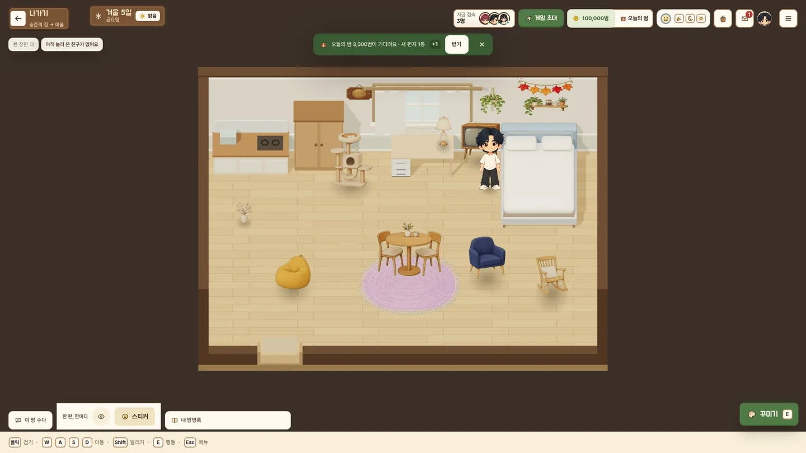
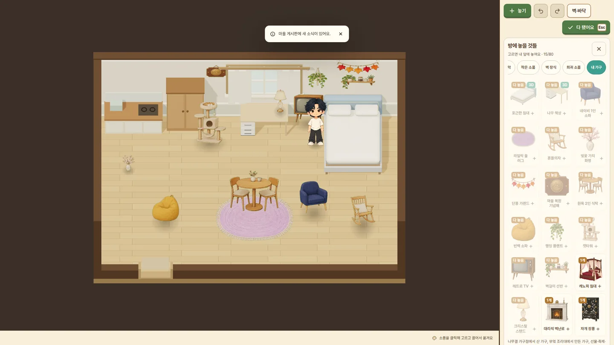

# 나무결 가구점 가구 그림 (2026-10-02)

브랜치 `claude/furniture-art`. 가구점 가구를 방 소품(`bedroom/*.webp`)과 같은 Higgsfield 손그림으로 바꾸고, 새 가구 8종을 넣고, 전체 가구의 크기·걸이 방식·판매처 문구를 점검한 기록.

(`npm run ui:shots -- --furniture-room --views fhd`로 다시 찍습니다. 3D 침대·책상 옆에 그림 카드, 러그, 책상 위 스탠드, 뒷벽 장식을 놓은 방입니다.)

## 그림 만들기

- 원본 6장(`_originals/furniture/furniture-sheet-0..5.png`)과 칸 순서는 `furniture-art-generation.json`. `NEW:slug`·`NEW-LUXURY:slug` 칸은 ref `furn-<slug>`.
- `node scripts/optimize-assets.mjs furniture`가 원본 해시 확인 → 마젠타 키잉(keyMagenta, 둘러싼 바탕 시드 90: 선풍기 망·러그 술·의자 살 사이 바탕까지) → defringeMagenta → 칸마다 가장 큰 조각의 1% 이상이고 칸 가장자리에 닿지 않는 조각만 남김(옆 칸 그림이 넘어온 조각 제거) → 카탈로그 비율 캔버스 → webp + 256² 썸네일 → json `web`에 크기·해시 기록.
- 카드 그리기 규칙: 방은 세워 두는 그림을 가로 w, 세로 w × (그림 세로/가로)로 그립니다. 그래서 카탈로그 h를 **그림에서 잰 비율 × w**로 맞췄습니다(h = 화면에 그려지는 높이). 러그는 d/w로 늘려 위에서 본 모양으로 바닥에 눕힙니다. 벽걸이는 w × h 판에 그대로 붙습니다.
- 빌드는 `app/lounge-assets.ts`에 적힌 파일만 해시해서 넣으므로 `furniture_*` 항목을 같이 둡니다.

## 크기 (가로 × 깊이 × 높이, 바뀐 것)

| 가구 | 전 | 후 | 이유 |
|---|---|---|---|
| 민트 침대 | 2.36×3.02×1.52 | 2.36×3.02×2.38 | 3/4 시점 그림이라 깊이만큼 위로 그려짐 |
| 로즈 벤치 소파 | ×1.14 | ×1.92 | 같은 이유 |
| 월넛 5단 책장 / 화이트 옷장 | 2.8 / 2.8 | 2.11 / 2.55 | 그림 비율 |
| 흔들의자 | 0.91×1.2×1.25 (3D) | 1.0×1.2×1.22 (그림) | 아래 참고 |
| 단풍 가랜드 | 2.0×0.6 | 1.8×0.9 | 그림 비율(벽) |
| 복주머니 | 0.6×0.8 | 0.45×1.0 | 세로로 긴 그림(벽) |
| 마을 복원 기념패 / 공사 현판 | 0.6×0.7 / 1.2×0.5 | 0.8×0.78 / 1.2×0.96 | 그림 비율(벽) |
| 금테 거울 / 오락기 / 망원경 | 0.8 / 0.9 / 0.9 폭 | 0.95 / 1.05 / 1.1 폭 | 친구 키 1.72 옆에서 너무 작았음 |
| 자개 장롱(신규) | – | 1.7×0.75×2.4 | 옷장보다 조금 작게 |

나머지도 높이를 그림 비율에 맞췄습니다(전부 `app/lounge-bedroom-catalog.ts`). 겹침 검사는 클라이언트 경고만이라(서버 저장은 겹침을 거절하지 않음) 크기 변경으로 저장이 막히지 않습니다.

## 흔들의자: 3D → 그림

kArchive 흔들의자는 채도 높은 청록·주황 장난감 느낌이라 STYLE-AND-SOURCES의 "채도가 높은 플라스틱 느낌 모델을 섞지 않는다"에 걸리고, 가구점의 다른 가구가 모두 그림으로 바뀐 뒤에는 혼자 튑니다. 3D 모델의 장점(돌리기)보다 같은 화풍이 중요하다고 보고 그림으로 바꿨습니다. 기본 가구(침대·책상 등)는 다른 CC0 세트라 3D로 둡니다. 스크린샷에서 3D 침대·책상 옆에 그림 카드가 어색하지 않은 것을 확인했습니다.

저장 호환: `LEGACY_ITEM_KIND`로 `kind: 'model'` 흔들의자를 읽으면 `prop`으로 바꿔 저장합니다(엄격 읽기도 통과). GLB 파일은 기록용으로 남기고 방에서는 받지 않습니다.

## 걸이 방식

- 벽걸이(`mount: 'wall'`): 단풍 가랜드, 복주머니, 마을 공사 현판, 마을 복원 기념패, 벽걸이 선반, 행잉 플랜트.
- 러그: 라일락 울 러그(위에서 본 모양).
- 축제 방패연·부채: 그림에 받침대가 있어 `small`(바닥이나 탁자 위)로 바꿨습니다. 예전에 벽에 걸어 둔 저장은 `LEGACY_WALL_ITEM`으로 읽을 때 같은 x의 뒷벽 앞 바닥으로 내려옵니다.

## 새 가구 8종

| ref | 이름 | 값 | 판매 | 종류·걸이 |
|---|---|---|---|---|
| furn-round-dining-set | 원목 2인 식탁 | 24,000 | 오늘의 가구 | 가구·바닥, 요리·만들기 가능 |
| furn-beanbag | 빈백 소파 | 16,000 | 오늘의 가구 | 패브릭·바닥 |
| furn-hanging-planter | 행잉 플랜트 | 9,000 | 오늘의 가구 | 식물·벽 |
| furn-cat-tower | 캣타워 | 22,000 | 오늘의 가구 | 가구·바닥 |
| furn-retro-tv | 레트로 TV | 20,000 | 오늘의 가구 | 음악·바닥 |
| furn-wall-shelf | 벽걸이 선반 | 10,000 | 오늘의 가구 | 벽 장식·벽 |
| furn-marble-fireplace | 대리석 벽난로 | 230,000 | 이번 주 명품 | 가구·바닥, 요리·만들기 가능 |
| furn-najeon-wardrobe | 자개 장롱 | 260,000 | 이번 주 명품 | 가구·바닥, 옷 갈아입기 가능 |

- 오늘의 가구 값은 소품(12,000~16,000)과 큰 색상판(25,000~35,000) 사이, 기존 범위 5,000~40,000 안. 명품은 기존 110,000~280,000 범위 안.
- 명품 순환(`luxuryStock`)은 `luxury: true`를 모두 돌리므로 2종이 자동으로 들어갑니다(10 → 12종, 주 2종 + 명품관·축제 무대 보너스).
- 강도 규칙(`lounge-finance.ts`): 명품·보상 제외, 20,000범 이하 여분만. 빈백·행잉 플랜트·벽걸이 선반·레트로 TV는 대상, 식탁·캣타워는 아님 — 기존 규칙 그대로입니다.

## 고친 문구

- 꾸미기 "내 가구": "공방에서 만든 가구" → 부엌 조리대(요리·만들기)에서 만든 가구, 선물·축제·마을 공사로 받은 가구. 희귀 탭에 축제 기념품·공사 현판도 나온다고 덧붙임.
- 아이템 설명의 구하는 곳(`whereFrom`): 명품이 "오늘의 가구 상점", 기본 가구도 "오늘의 가구 상점", 축제 기념품·공사 현판이 "마을 꾸러미 완성 보상"으로 나오던 것을 실제 판매처로. 비료·미끼·가구의 "공방에서 만들기" → 요리·만들기.
- 가구점 상점 창 "공방에서 만들 수도 있어요" → "내 방 요리·만들기에서 만들 수도 있어요".
- 명품관 두 칸 설명 "(모두 2종)" → "(명품관으로 모두 2종 더)" (기본 2종에 더해지는 수).

## 남은 일

- 만들기 가구 16종(꽃 화분·텐트·분수 등)은 아직 SVG. 같은 시트 방식으로 그리면 `PAINTED_FURNITURE`와 json 칸만 더하면 됩니다.
- 벽걸이는 카메라가 52° 내려다봐서 세로가 약 0.62배로 눌려 보입니다(기존 포스터·사진 줄과 같음). 바꾸려면 벽 판 전체를 손봐야 해서 이번에는 두었습니다.
