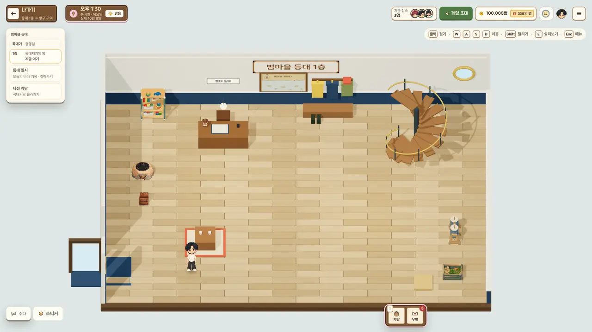
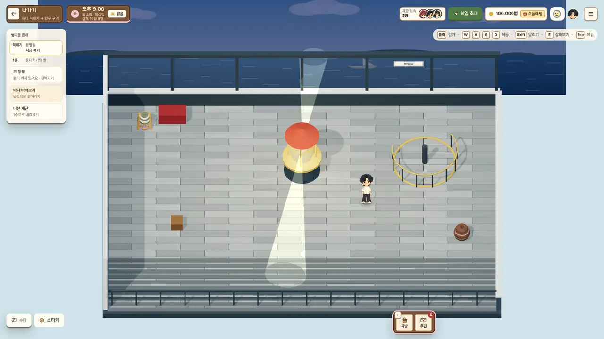

# 범마을 등대 실내 (2026-10-08)

브랜치 `claude/lighthouse-inside`. 항구 바위곶의 등대에 들어갈 수 있게 했다. 엔드게임 "여섯섬의 등대"([시간 체계·엔드게임 설계 2부](design-time-and-endgame.md))가 나중에 이 등대를 쓰도록 데이터 자리만 마련했고, 이야기는 만들지 않았다.

## 1. 무엇이 생겼나

| 자리 | 내용 |
| --- | --- |
| 항구 등대 문 | E 또는 문으로 걸어 들어가기 → 1층. 다른 가게 실내와 같은 페이드·입장·퇴장 흐름(`enterShop`의 같은 길, `leaveLighthouse`). 나올 때는 문 앞 한 걸음 바깥(`lighthouseDoorOutside`). |
| 1층 `lighthouse` (등대지기의 방) | 등대 일지 책상, 외투 고리, 해도, 둥근 창, 난로(kArchive), 지난 일지 책장, 나선 계단. 왼쪽 벽 공용 문으로 항구에 나간다. |
| 꼭대기 `lighthouseTop` (등명실) | 큰 등불(렌즈 고리 6겹 + 전구), 뒷벽 통유리 너머 바다 그림, 앞쪽 발코니 철망 바닥과 난간. 문이 없다(왼쪽 벽이 막혀 있음). |
| 나선 계단 | 두 층 같은 자리(뒤 오른쪽). 계단 앞에서 E, 또는 계단 쪽으로 계속 걸어 들어가면 다른 층으로(`walksIntoStair`, 지도 문 규칙 `lounge-map-doors.ts` 그대로). 도착은 계단 손 닿는 거리 밖(`stairArrival`). |

카메라·걷기·인물 크기는 다른 실내와 같은 구역 공통 규격(`lounge-interior-view.ts`). 방 껍데기(바닥·벽·문)도 공용 `createInteriorScene`이 짓고, 등대만의 것은 `app/lounge-lighthouse-interior.ts`가 더한다. 간단 화면(입체 화면을 못 쓰는 기기)에는 오른쪽 칸에 일지·계단·등불·바다 바라보기 버튼이 있다.

## 2. 작은 상호작용

- **등대 일지(읽기 전용, 클라이언트만)**: 실제 하루에 한 쪽. 오늘 날씨와 바다 상태, 먼바다 배(출항 시각·결항, 지금 바다에 나간 친구), 이번 주 낚시 대회 기록 중 가장 귀한 물고기(물고기 `weight`가 가장 낮은 것), 폭풍 경보(오늘·내일), 가붕의 한 줄. 지난 6일 쪽도 넘겨 볼 수 있다(지난 쪽에는 "이번 주"와 "지금 바다에" 줄이 없다). 같은 날이면 모든 화면에서 같은 글.
- **큰 등불**: 게임 시각 18:00~06:00에 켜진다(`lighthouseLampLit`, 가붕 일과와 같은 시각). 켜져 있으면 렌즈가 돌고 두 줄기 빛이 방을 훑는다. 항구 바깥에서도 같은 각도(`lighthouseBeamAngle`, 16초에 한 바퀴)로 빛줄기 두 개가 돈다. 낮밤 설정을 끄면 항구 빛줄기도 끈다.
- **바다 바라보기**: 난간에서 E. 카메라가 창밖 바다를 6.5초 동안 천천히 훑고 잔잔한 한 줄이 뜬다. 하루 한 번 무드렛 "등대에서 바다를 바라봤어요"(+3, 6시간). 서버가 등명실·난간 위치를 확인하고(`lounge-cloud-engine.ts`), 무드 기록 `sv`(KST 날)로 하루 한 번만. 범·물건은 그대로.

## 3. 엔드게임 훅 (`app/lounge-lighthouse.ts`)

- `LIGHTHOUSE_PLACE = 'harbor-lighthouse'`: 장 데이터의 `gather` 단계나 장소 이름이 이 id를 쓰면 된다.
- `LIGHTHOUSE_AREAS`, `isLighthouseArea`, `LIGHTHOUSE_FLOOR`: 서버 구역(누가 등대에 모였는지 셀 때).
- `LIGHTHOUSE_STORY` / `lighthouseStory({ day, flags })`: 편지·사건 한 장(`letter` | `event`, 제목, 줄들, `needs.flags`·`needs.fromDay`)을 넣으면 그날 일지 쪽에 자동으로 실린다. 지금은 빈 배열.
- `logbookPage` / `logbookPages`: 일지 API. 입력은 날(KST), 오늘, 이번 주 대회 기록, 바다에 나간 친구, 마을 깃발, 이야기 항목.
- `lighthouseLampLit` / `lighthouseBeamAngle`: 3막 결말의 "이후 밤마다 마을 바다에 등대 불빛"은 이 둘을 그대로 쓰면 된다.

## 4. 지도

- 항구 미니맵의 등대 핀이 문 종류(`door`)가 되고, 제목이 "범마을 등대 · 안으로 들어갈 수 있어요 (1층 등대지기의 방, 꼭대기 등명실)".
- 등대 안의 친구는 항구 지도에서 등대 문 앞(실내 표시), 마을 지도에서는 항구 입구에 "범마을 등대 1층/꼭대기"로.
- 실내 HUD(왼쪽 위 안내 칸)에 층 표시(꼭대기 / 1층, 지금 여기)와 일지·계단·등불·바다 바라보기 걸어가기 버튼.

## 5. 성능

다른 실내와 같은 규격: 모델은 한 번만 불러 인스턴스 한 번에 그리고, 단색 상자는 색마다 하나로 묶는다. 렌즈가 돌 때만(등명실, 밤) 다시 그리며 각도가 0.02라디안 넘게 바뀔 때만이다. 항구는 등불이 켜져 있을 때만 쉬는 화면을 초당 4번 대신 10번 그린다.

## 6. 파일

- 데이터·API: `app/lounge-lighthouse.ts`, 기하: `app/lounge-lighthouse-layout.ts`, 3D: `app/lounge-lighthouse-interior.ts`
- 창: `app/lounge/LighthouseLogbook.tsx`, `app/lounge/lighthouse.css`
- 연결: `lounge-games.ts`(구역), `lounge-venues.ts`, `lounge-interior-layout.ts`·`lounge-interior-scene.ts`·`lounge-interior-3d.tsx`, `lounge-district-counters.ts`·`lounge-district-minimap.ts`·`lounge-village-minimap.ts`, `lounge-harbor-scene.ts`, `lounge-mood*.ts`(`seaView`), `lounge-cloud-engine.ts`
- 테스트: `tests/lounge-lighthouse.test.mjs`, UI 캡처: `scripts/ui-shots.mjs`의 `lighthouse` 단계(`lighthouse`, `lighthouse-logbook`, `lighthouse-top`)

## 7. 남은 일

- 가붕이 실내에 서 있지는 않다(일과의 `hb.lighthouse-in`은 그리지 않는 실내 자리). 주민 대화 작업(`claude/npc-talk-c1`)과 겹치지 않게 이번에는 손대지 않았다.
- 등명실 바다 그림은 한 장(밤에는 어둡게 물들임). 계절·날씨별 그림은 나중에.
