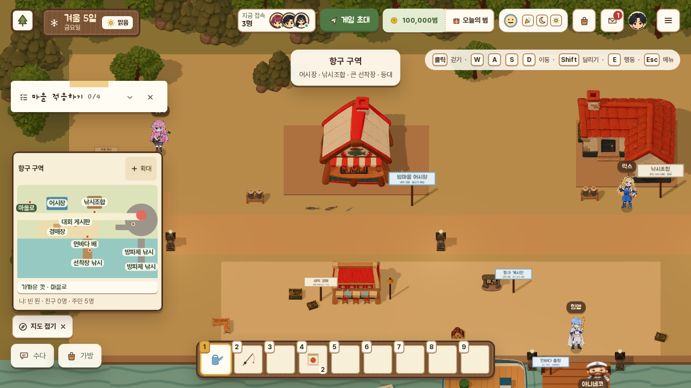
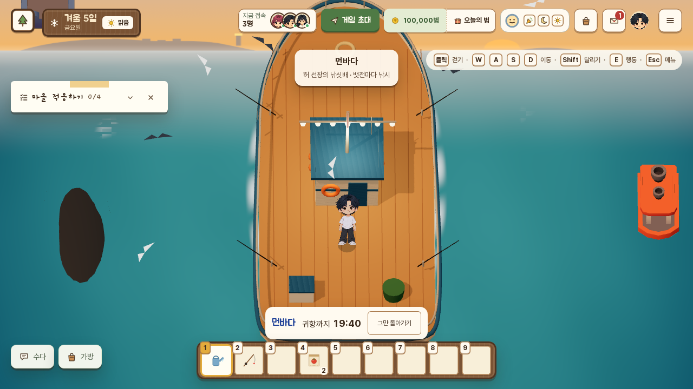
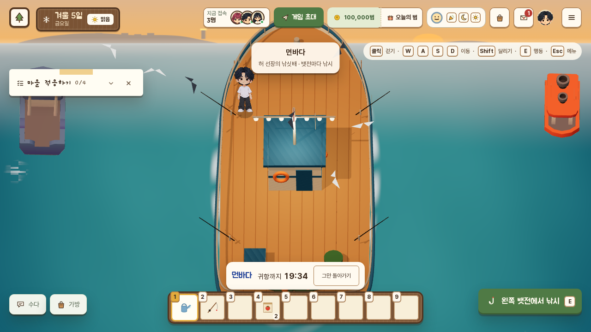
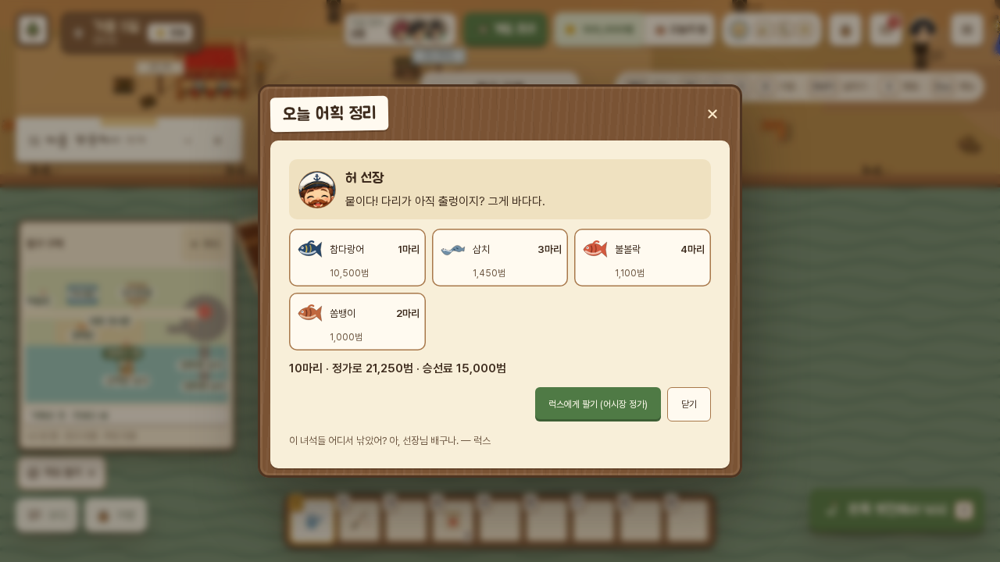

# 먼바다 낚싯배 · 바다 어종 대량 추가 설계

작성 2026-10-02 · 상태: 구현(브랜치 `claude/sea-fishing`, `claude/integration` 병합: 증권·가구·물고기 값 인상·민물 어종과 함께) · 관련: [낚시 업그레이드](design-fishing-upgrade.md)(엔진·미니게임), [NPC 2단계](design-npcs-stage2.md)(항구 구역·허 선장·가붕·럭스), [음식·가게](design-food-and-shops.md)(버프 칸), 다른 세션 `claude/fish-prices`(기존 물고기 판매가 ×1.5·전설 ×1.3, 하루 판매 포화·한도 폐지, 같은 어종 4마리까지 정가·5마리째부터 하락)

> **게임 시계 이후(2026-10-02)**: 출항은 게임 05~19시 매 게임 정시(실제 2분 30초 간격), 새벽 초대는 게임 05~07시입니다. 항해 20분·하루 1회 승선·멀미약(자정까지)은 실제 시간·실제 날 그대로. [게임 시계 설계 8.2](design-game-clock.md#82-먼바다-출항-applounge-voyage-datats-lounge-voyagets).

사용자 승인을 받은 확정 설계를 정리하고, 구현하면서 정한 숫자를 그대로 적었습니다.

## 1. 한눈에

| 항목 | 결정 |
|---|---|
| 배 | 항구 큰 선착장 서쪽에 정박한 허 선장의 낚싯배. 선착장 머리에 **출항 안내판**, 옆에 허 선장 |
| 출항 | KST 05:00~19:00 매 정시·30분(하루 29편). **출항 2분 전부터 승선**, 한 배 최대 **4명**(각자 승선료) |
| 항해 | 실제 **20분**. 상단에 "귀항까지 mm:ss". 시간이 끝나면 자동 귀항(서버가 다음 명령·조회 때 처리), "그만 돌아가기"로 조기 귀항(환불 없음). 출항 전 내리면 환불 |
| 승선료 | **15,000범**, **하루 1회**(새벽 초대 배 포함) |
| 해금 | 항구 구역 열림(또는 승준 탐험 패스) + **낚시 Lv4** |
| 날씨 | 폭풍이면 **결항**(가붕이 전날 예보). 비 오는 날 **입질 +15%**(입질까지 시간 ÷1.15). 먼바다 **보물 상자 +5%p** |
| 새벽 초대 | 최근 7일(오늘 제외) 중 **4일 이상** 배를 탄 친구에게 05~07시 허 선장이 찾아옴. 수락: 승선료 **30% 할인(10,500범)**, 3분 뒤 전용 출항, 친구 **최대 3명** 초대, **새벽 전용 어종 2종**·전설 ×1.2. 거절하면 그날 다시 안 옴 |
| 멀미약 | **1,500범**, 츠나데(언덕 주택가 텃밭) · 의사 메르시(3단계 NPC, 병합되면 자동). 먹은 날 KST 자정까지 배 흔들림·카메라 흔들림·**손맛 칸 출렁임**이 꺼짐 |
| 어종 | **51종 추가**: 가까운 바다 13 · 먼바다 33 · 새벽 초대 2 · 전설 3 |
| 먼바다 값 | 입질 가중 평균 **약 2,030범**, 대물 6,500~11,000, 전설 13,500~15,000 (인상 후 기준) |

## 2. 플레이 흐름

1. 항구 구역 큰 선착장 머리의 **출항 안내판**(E): 승선 창 — 승선료, 다음 출항 시각과 남은 시간, 이번 배의 남은 자리(4칸), 오늘 날씨(결항이면 빨간 표시), 내일 결항 예보, 내 멀미약 상태, 해금 조건.
2. 승선 시간(출항 2분 전)에 **타기** → 서버가 승선료를 받고 자리를 잡음(`voyageBoard`). 출항 전에는 **내리기**로 환불.
3. 출항 시각이 되면 화면이 3초 동안 배가 방파제를 빠져나가는 연출 → **먼바다 갑판**(`offshore` 구역). 서버는 출항 5초 전부터 갑판 진입을 받습니다(시계 오차).
4. 갑판(약 6×14칸): 난간 네 곳(좌·우 뱃머리, 좌·우 고물)에서 E로 낚시 — 기존 낚시 창이 그대로 열리고 장소만 `offshore`. 함께 탄 친구(최대 4명)가 각자 난간에서 동시에.
5. 상단에 "귀항까지 mm:ss"와 "그만 돌아가기". 20분이 지나면 화면이 스스로 항구로 돌아가고, 서버도 그 친구가 다음에 무엇을 보내든(조회 포함) 선착장으로 옮깁니다.
6. 돌아오면 **오늘 어획 정리 창**: 이번 항해에 낚은 어종·마릿수, 정가 기준 합계, **럭스에게 팔기**(어시장 정가 판매) / 닫기(`voyageDone`).

### 서버 권위
- 상태는 `world.life.voyage.u[uid]` 하나: `trip`(id·출항 시각·낸 승선료·새벽 여부·조기 귀항 시각·어획), `days`(배 탄 KST 날짜, 최근 8일), `knock`(오늘 새벽 초대와 대답), `pill`(멀미약 칸), `guestOf`(친구의 새벽 배 초대).
- 항해 상태(승선 대기 / 항해 중 / 귀항)는 **저장값과 시계로만 계산**합니다(`tripPhase`). 20분 시점에 아무것도 실행할 필요가 없고, 클라이언트·서버가 같은 답을 냅니다.
- 먼바다 장소 `offshore`는 `FISH_SPOTS`·`ALL_FISH_SPOTS`(일반 낚시 장소 목록)에 **없습니다**. 낚시 엔진은 `offshore` 던지기를 항해 중일 때만 받고(`spotBoat`), 클라우드 엔진은 플레이어가 실제로 갑판(`area: 'offshore'`)에 있을 때만 받습니다. 옛 `cast`는 원래부터 허브 장소만 받습니다. 통발은 배 위에 놓을 수 없습니다.
- 갑판 진입(`area: 'offshore'`)은 항해 중일 때만. 항해가 끝났는데 갑판에 남아 있으면 그 친구의 다음 명령·조회에서 선착장(`HARBOR_VOYAGE.landing`)으로 옮깁니다.
- 승선은 항구 구역에서만(출항 안내판), 멀미약은 파는 사람이 있는 구역에서만.

## 3. 바다 어종 51종

**가까운 바다 (13종)**

| 이름 | 곳 | 계절 | 때·날씨 | 성향·난이도 | 희귀도 | 크기(cm) | 값(범) | 조건 |
|---|---|---|---|---|---|---|---|---|
| 학꽁치 | 동쪽 바다 데크·밤 항구 | 봄·가을 | 낮 | 쏜살 22 | 40 | 20~40 | 330 |  |
| 망둥어 | 갯바위·밤 항구 | 여름·가을 | 종일 | 가라앉음 15 | 45 | 10~25 | 180 |  |
| 꼴뚜기 | 밤 항구 | 봄 | 밤 19~01시 | 떠오름 24 | 35 | 6~15 | 360 |  |
| 주꾸미 | 동쪽 바다 데크·갯바위 | 봄·가을 | 종일 | 가라앉음 30 | 28 | 10~25 | 520 |  |
| 보리멸 | 동쪽 바다 데크 | 여름 | 낮 맑음·흐림 | 쏜살 26 | 32 | 15~30 | 420 |  |
| 성대 | 동쪽 바다 데크 | 겨울·봄 | 낮 | 제멋대로 40 | 18 | 20~40 | 900 |  |
| 쏠배감펭 | 갯바위 | 여름 | 종일 | 떠오름 52 | 8 | 15~35 | 1,800 |  |
| 벵에돔 | 갯바위 | 여름·가을 | 낮 | 쏜살 55 | 12 | 20~45 | 1,500 | 새우 미끼 |
| 청어 | 동쪽 바다 데크·밤 항구 | 겨울 | 종일 | 쏜살 20 | 38 | 20~35 | 360 |  |
| 도다리 | 동쪽 바다 데크 | 봄 | 낮 | 가라앉음 36 | 22 | 20~40 | 780 |  |
| 꽁치 | 동쪽 바다 데크·밤 항구 | 가을 | 밤 18~02시 | 쏜살 22 | 35 | 25~35 | 300 |  |
| 베도라치 | 갯바위 | 겨울·봄 | 낮 | 가라앉음 18 | 30 | 10~25 | 280 |  |
| 노랑가오리 | 동쪽 바다 데크 | 여름 | 밤 20~04시 | 가라앉음 58 | 9 | 50~120 | 1,600 |  |

**먼바다 (33종)**

| 이름 | 곳 | 계절 | 때·날씨 | 성향·난이도 | 희귀도 | 크기(cm) | 값(범) | 조건 |
|---|---|---|---|---|---|---|---|---|
| 삼치 | 먼바다 | 봄·가을·겨울 | 종일 | 쏜살 40 | 40 | 50~100 | 1,450 |  |
| 부시리 | 먼바다 | 여름·가을 | 낮 | 쏜살 62 | 22 | 60~120 | 2,400 |  |
| 민어 | 먼바다 | 여름 | 종일 | 가라앉음 55 | 14 | 50~100 | 2,700 |  |
| 돌돔 | 먼바다 | 여름·가을 | 낮 | 제멋대로 70 | 8 | 30~60 | 4,200 | 낚싯대 2단 |
| 다금바리 | 먼바다 | 가을 | 종일 | 가라앉음 80 | 3 | 50~100 | 8,500 | 낚싯대 3단 |
| 대왕오징어 | 먼바다 | 겨울 | 밤 21~04시 | 떠오름 82 | 3 | 300~800 | 9,000 | 낚싯대 3단 |
| 개복치 | 먼바다 | 여름 | 낮 10~16시 맑음·흐림 | 떠오름 60 | 4 | 100~250 | 6,500 |  |
| 참다랑어 | 먼바다 | 여름·가을 | 낮 | 쏜살 85 | 5 | 100~250 | 10,500 | 낚싯대 3단 |
| 청새치 | 먼바다 | 여름 | 낮 맑음·흐림 | 쏜살 88 | 3 | 150~300 | 11,000 | 낚싯대 3단, 새우 미끼 |
| 황새치 | 먼바다 | 가을 | 밤 20~04시 | 제멋대로 84 | 3 | 120~300 | 9,500 | 낚싯대 3단 |
| 만새기 | 먼바다 | 여름 | 낮 | 떠오름 48 | 20 | 50~120 | 2,100 |  |
| 가다랑어 | 먼바다 | 여름·가을 | 종일 | 쏜살 38 | 35 | 40~80 | 1,550 |  |
| 날치 | 먼바다 | 여름 | 낮 맑음·흐림 | 떠오름 20 | 40 | 20~35 | 950 |  |
| 쏨뱅이 | 먼바다 | 사계절 | 종일 | 가라앉음 26 | 40 | 15~30 | 1,000 |  |
| 쑤기미 | 먼바다 | 봄·가을·겨울 | 종일 | 가라앉음 44 | 15 | 15~35 | 1,700 |  |
| 홍어 | 먼바다 | 겨울·봄 | 종일 | 가라앉음 52 | 14 | 50~120 | 2,400 |  |
| 아귀 | 먼바다 | 겨울·봄 | 종일 | 가라앉음 42 | 20 | 40~100 | 1,850 |  |
| 임연수어 | 먼바다 | 겨울 | 종일 | 느긋 30 | 30 | 30~50 | 1,300 |  |
| 대게 | 먼바다 | 겨울 | 종일 | 가라앉음 50 | 12 | 10~18 | 3,050 |  |
| 킹크랩 | 먼바다 | 겨울 | 밤 | 가라앉음 72 | 5 | 20~30 | 7,000 | 낚싯대 2단 |
| 꼬치고기 | 먼바다 | 여름·가을 | 낮 | 쏜살 36 | 30 | 30~60 | 1,350 |  |
| 줄삼치 | 먼바다 | 가을 | 낮 | 쏜살 40 | 25 | 40~70 | 1,600 |  |
| 벤자리 | 먼바다 | 봄·여름 | 종일 | 제멋대로 32 | 30 | 20~40 | 1,300 |  |
| 범돔 | 먼바다 | 봄·여름 | 낮 | 느긋 22 | 32 | 10~20 | 1,000 |  |
| 능성어 | 먼바다 | 여름·가을 | 종일 | 가라앉음 62 | 10 | 40~80 | 3,250 | 낚싯대 2단 |
| 자바리 | 먼바다 | 가을·겨울 | 종일 | 가라앉음 70 | 6 | 50~100 | 5,200 | 낚싯대 2단 |
| 불볼락 | 먼바다 | 겨울·봄 | 종일 | 떠오름 26 | 38 | 15~30 | 1,100 |  |
| 황볼락 | 먼바다 | 가을·겨울 | 밤 | 떠오름 34 | 18 | 15~30 | 1,450 |  |
| 초롱아귀 | 먼바다 | 사계절 | 밤 22~04시 | 제멋대로 66 | 6 | 20~50 | 4,500 |  |
| 꼼치 | 먼바다 | 겨울 | 밤 | 느긋 30 | 20 | 30~60 | 1,350 |  |
| 먹장어 | 먼바다 | 사계절 | 밤 | 제멋대로 38 | 22 | 40~70 | 1,200 |  |
| 잿방어 | 먼바다 | 여름·가을 | 종일 | 쏜살 74 | 8 | 80~160 | 4,800 | 낚싯대 3단 |
| 돛새치 | 먼바다 | 여름 | 낮 맑음·흐림 | 쏜살 86 | 3 | 150~300 | 9,800 | 낚싯대 3단 |

**새벽 초대 배 (2종)**

| 이름 | 곳 | 계절 | 때·날씨 | 성향·난이도 | 희귀도 | 크기(cm) | 값(범) | 조건 |
|---|---|---|---|---|---|---|---|---|
| 여명 참돔 | 먼바다 | 사계절 | 종일 | 제멋대로 72 | 6 | 40~90 | 5,500 | 새벽 초대 배 |
| 샛별 삼치 | 먼바다 | 사계절 | 종일 | 쏜살 60 | 8 | 60~110 | 3,200 | 새벽 초대 배 |

**전설 (3종)**

| 이름 | 곳 | 계절 | 때·날씨 | 성향·난이도 | 희귀도 | 크기(cm) | 값(범) | 조건 |
|---|---|---|---|---|---|---|---|---|
| 황금 다랑어 | 먼바다 | 여름 | 낮 05~08시 맑음·흐림 맑음만 | 쏜살 94 | 1 | 180~300 | 15,000 | Lv8 · 낚싯대 3단 · 1번 |
| 심해의 등불 | 먼바다 | 겨울 | 밤 22~04시 | 떠오름 90 | 1 | 60~110 | 14,000 | Lv7 · 낚싯대 3단 · 1번 |
| 무지개 개복치 | 먼바다 | 봄 | 낮 10~14시 비 | 떠오름 86 | 1 | 150~300 | 13,500 | Lv7 · 낚싯대 2단 · 1번 |

- 가까운 바다 어종 중 바다 데크·갯바위·밤 항구에 사는 물고기는 기존 규칙대로 **방파제·큰 선착장**에도 옵니다(`lounge-items.ts` FISH).
- 먼바다·새벽·전설 어종은 `spots: ['offshore']`뿐이라 뭍에서는 절대 물지 않습니다(시험으로 확인).
- **조건**(`FishProfile`): `need.rod`(낚싯대 단계), `need.bait`(그 미끼를 달고 던질 때만), `dawn`(새벽 초대 배에서만), `weather`(전설의 "맑음만"). 조건이 붙은 물고기는 조용한 물에 끼어드는 "방문객"으로도 나오지 않습니다.
- 전설 3종은 기존 새 전설처럼 카탈로그 계절이 비어 있고(`seasons: []`) 진짜 계절은 프로필에 있습니다. 친구마다 한 번.
- 무게는 기존 식(`15.5 × 체형 × (cm/10)³ g`)에 체형 값(`SEA_BUILD`)만 더했습니다(대왕오징어·새치류는 길고 가볍게, 개복치·아귀·게는 묵직하게).
- 도감(낚시 수첩): 기존 수첩이 FISH 전체를 읽으므로 실루엣·힌트·서식지가 자동으로 붙습니다(서식지 "먼바다"). 박물관 기증 가능(물고기는 모두 `museum: true`). 그림은 `ItemIcon.tsx` FISH_LOOK에 51종 추가.
- 꾸러미: 꾸러미 칸은 어종 id를 직접 적으므로 영향 없음. 항구 해금 조건(박물관 물고기 12종)은 어종이 늘어 조금 쉬워질 뿐 바뀌지 않습니다.
- 럭스(어시장)는 물고기를 모두 정가로 삽니다(`buyerOf` → 'fishmarket').

### 해산물 요리 5종 (판매가 = 재료값 × 1.25 + 100)

| 요리 | 재료 | 효과 |
|---|---|---|
| 참다랑어 회 | 참다랑어 1 | 물고기의 행운 |
| 삼치구이 | 삼치 1 + 나무 1 | 물고기의 행운 |
| 민어탕 | 민어 1 + 양배추 1 | 무럭무럭 |
| 대게찜 | 대게 2 | 친화력 |
| 아귀찜 | 아귀 1 + 시금치 1 | 광부의 힘 |

## 4. 날씨·흔들림·멀미약

- 배의 흔들림(롤·피치·히브)과 손맛 칸 출렁임은 날씨 따라 커집니다: 맑음 220 · 흐림 320 · 눈 420 · 비 480 (막대 단위, 10,000 중). 폭풍은 결항.
- **손맛 칸 출렁임은 서버도 같이 계산**합니다. `FightSetup.sway`(진폭)를 챔질 때 저장하고, 미니게임은 정수 삼각파(`swayAt`, 4초 주기)로 칸 위치에 더합니다. 브라우저와 서버가 같은 결과를 냅니다. 뭍에서는 `sway`가 없어서 옛 판정과 똑같습니다.
- **멀미약**(`seasick-pill`, 도구): 츠나데에게 1,500범(`pillBuy`, 한 번에 최대 5개), 가방에서 먹기(`pillTake`). 먹으면 `voyage.u.pill = { kind: 'steady', food, until: 다음 KST 자정 }` — 음식 버프 칸(`SlotBuff`)과 같은 모양의 **세 번째 칸(약)**이라 식사·간식 칸을 덮어쓰지 않습니다. 하루 한 번.
  - 효과: 배 롤·피치·히브, 카메라 흔들림, 손맛 칸 출렁임(서버 `sway` = 0)이 꺼짐.
  - 판매처는 데이터(`PILL_SELLERS`): 츠나데(언덕 주택가), 메르시(시장 거리 진료소 가정). **메르시는 `NPC_IDS`에 그 id가 있을 때만 활성**이라 3단계 세션이 병합되면 코드 변경 없이 켜집니다(구역이 다르면 이 데이터 한 줄만 고치면 됨).
- 1,500범 근거: 승선료의 10%, 빵집 간식(400~900)보다 조금 비싸고 주점 한 상(2,500)보다 쌉니다. 손맛 칸이 덜 출렁이면 큰 고기 놓치는 일이 줄어서, 항해 한 번 기대순익(3~4.5만)의 몇 %만 지키면 본전입니다.

## 5. 승선료와 기대수익

`node --experimental-strip-types --no-warnings scripts/sea-fishing-economy.mjs`: 엔진 그대로 20분을 낚고(기준 플레이어), **지금 게임의 값과 판매 규칙 그대로** 어시장(정가 100%)에 판다고 보고 값을 매깁니다. `claude/fish-prices` 병합 후 기준입니다: 기존 어종은 ×1.5·전설 ×1.3이 이미 들어가 있고(새 바다 어종은 처음부터 인상 후 값이라 다시 곱하지 않음), 판매는 `lounge-life-plus.ts`의 `sellTotal` 그대로 — 같은 어종 하루 **4마리까지 정가**(`FISH_DEMAND_FREE`), 5마리째부터 보통 수요 곡선, **물고기는 시장 포화·하루 판매 한도(10만 범)에서 제외**. 먼바다 어종도 아이템 종류가 `fish`라 이 규칙이 똑같이 적용됩니다(`isFishSale`). 은·금 품질 보너스와 가방 판매(85%)는 넣지 않았습니다. 사람 속도(한 마리 최소 34초 ≈ 20분에 35마리)와 기준 플레이어 최고 속도(`PACE_MS=0`) 둘 다 봤습니다.

| 20분 · 사람 속도(약 35마리) | 낚음 | 판매 | 승선료 뺀 순익 | 방파제 대비 |
|---|---|---|---|---|
| 방파제 · 가을 낮 · 3단 · Lv6 | 34 | 17,134 | 17,134 | — |
| 먼바다 · 가을 낮 · 3단 · Lv6 | 29 | 46,725 | 31,725 | 1.9배 |
| 방파제 · 여름 낮 · 2단 · Lv4 | 35 | 20,306 | 20,306 | — |
| 먼바다 · 여름 낮 · 2단 · Lv4 | 32 | 44,996 | 29,996 | 1.5배 |
| 먼바다 · 여름 낮 · 3단 · Lv8 · 새우 미끼 | 24 | 45,350 | 30,350 | 1.5배 |
| 방파제 · 겨울 밤 · 3단 · Lv6 | 32 | 17,294 | 17,294 | — |
| 먼바다 · 겨울 저녁 · 3단 · Lv6 | 35 | 60,175 | 45,175 | 2.6배 |
| 먼바다 · 봄 비 · 3단 · Lv6 | 34 | 46,096 | 31,096 | — |

| 20분 · 최고 속도 | 낚음 | 순익 | 방파제 대비 |
|---|---|---|---|
| 방파제 · 가을 낮 · 3단 · Lv6 | 73 | 46,936 | — |
| 먼바다 · 가을 낮 · 3단 · Lv6 | 53 | 70,238 | 1.5배 |
| 방파제 · 여름 낮 · 2단 · Lv4 | 63 | 30,848 | — |
| 먼바다 · 여름 낮 · 2단 · Lv4 | 63 | 66,103 | 2.1배 |
| 먼바다 · 여름 낮 · 3단 · Lv8 · 새우 미끼 | 56 | 82,172 | 2.7배 |
| 방파제 · 겨울 밤 · 3단 · Lv6 | 75 | 41,390 | — |
| 먼바다 · 겨울 저녁 · 3단 · Lv6 | 66 | 90,199 | 2.2배 |
| 먼바다 · 봄 비 · 3단 · Lv6 | 78 | 70,990 | — |

- 결론: 사람 속도로 한 번 항해하면 판매 **약 4.5~6만 범**, 승선료 뺀 순익 **약 3~4.5만 범**으로 같은 20분 항구 낚시의 **약 1.5~2.6배**입니다(겨울 저녁처럼 항구가 약한 철에 더 큼). 먼바다는 대물이 많아 놓치는 일도 늘어서 마릿수는 조금 적습니다.
- 새 판매 규칙의 영향은 작습니다(이전 가정 "4마리 뒤 60%"보다 순익 +0~1,400범). 먼바다는 어종이 고르게 섞여 한 어종이 4마리를 넘는 일이 드물고, 한 번 항해 판매가 10만 범 한도에 닿는 경우(최고 속도 겨울 저녁 10.5만)도 물고기는 한도 밖이라 그대로 다 받습니다.
- 그래서 승선료 15,000범(하루 1회)은 그대로 둡니다: 사람 속도 순익이 항구의 1.5배 이상이고, 승선료가 판매의 약 1/4~1/3이라 "타면 확실히 이득, 그래도 공짜는 아님" 선을 지킵니다.
- 승선료 15,000범은 범을 없애는 곳(sink)입니다. 새로 생기는 범은 없습니다(출항 전 하차 환불만 같은 액수로 돌려줌). 원장 불변식은 시험이 매 행동마다 확인합니다.
- 해산물 요리 5종도 `claude/fish-prices`의 방식대로 `lounge-items.ts` `DISHES`가 재료값 공식(× 1.25 + 100)으로 값을 매깁니다(`dishOf`에 값 인자 없음). 작물은 `CROP_SELL_REF` 값(양배추 3,600·시금치 2,200)이라 민어탕 7,980·아귀찜 5,160·참다랑어 회 13,230·대게찜 7,730·삼치구이 1,940범입니다.

## 6. 새벽 초대 (단골)

- 조건(서버, `dawnKnock`): KST 05:00~07:00, 최근 7일(오늘 제외) 중 배를 탄 날 ≥ 4, 오늘 아직 안 물어봄, 오늘 배를 안 탐, 해금됨, 결항 아님. 시각과 기록만으로 정해지는 **결정적 계산**입니다.
- 화면: 조건이 맞으면 마을·구역에 있을 때 허 선장이 찾아와 말을 겁니다("오늘 새벽 배, 먼저 갈래?"). 수락하면 함께 갈 친구(최대 3명)를 고릅니다.
- 수락(`voyageInvite yes`): 10,500범, 3분 뒤 출항하는 **전용 새벽 배**에 바로 자리. 초대받은 친구는 승선 창에 "○○의 새벽 배"가 뜨고 출항 전까지 선착장에서 같은 할인으로 탑니다(그날의 1회로 계산). 거절(`no`)하면 그날 다시 안 옵니다.
- 새벽 배에서만: **여명 참돔**, **샛별 삼치**, 전설 확률 ×1.2.

## 7. 화면·그래픽·소리

- **갑판 장면**(`lounge-offshore-scene.ts`): **Kenney Watercraft Kit 2.1(CC0)**을 먼저 살폈습니다(내려받아 렌더해 봄). 키트의 `boat-fishing-small`은 조타실이 갑판 대부분을 덮는 장난감 배라서 친구 4명이 난간마다 서는 6×14칸 갑판이 나오지 않아, **걷는 배는 코드로 만들었습니다**(`lounge-boat-model.ts`: 곡선 선체·흰 뱃전·파란 띠·빨간 배 밑, 조타실과 창, 집어등 줄을 단 돛대·안테나·깃발, 난간과 기둥, 아이스박스·미끼통, 그물 더미, 부표, 구명환, 난간 네 곳의 낚싯대 거치대, "범마을호" 이름판). 키트 모델은 **양옆을 지나가는 배**(작은 어선·예인선)로 씁니다(`public/models/village/watercraft/`, 공용 텍스처를 GLB 안에 넣음, ASSETS.md K2행).
- **바다**: 화면 끝까지 덮는 수면 셰이더(시간에 따라 일렁이는 물결, 먼 곳 짙은 남색 → 배 근처 청록, 물결 꼭대기 포말, 해 반사), 수평선 안개, 멀리 마을 섬과 등대 실루엣, 갈매기 떼, 지나가는 배.
- **흔들림**: 배·캐릭터가 한 몸으로 롤·피치·히브(날씨에 따라 진폭), 카메라는 그 절반만. 멀미약을 먹었거나 "움직임 줄이기"면 끔.
- **시간대**: 새벽 분홍 · 낮 반짝임 · 저녁 금빛 · 밤 달빛 길과 배 집어등, 비 오는 날 빗줄기와 흐린 바다.
- **그래픽 품질 낮음**: 포말·반사·먼 배·갈매기 끔.
- **낚시 연출**: 기존 낚시 창을 그대로 쓰고, 갑판에서는 가까운 난간의 낚싯대 끝에서 뱃전 밖으로 줄과 찌가 날아가 파도 따라 오르내립니다. 입질에는 찌가 잠기며 물보라 고리, 손맛 겨루기 중에는 찌가 좌우로 끌리고, 드문 물고기 이상을 낚으면 찌 옆에서 한 번 점프합니다. 돌고래 떼·고래 등이 가끔 지나갑니다(도감 "목격" 기록은 다음 단계, 10장).
- **항구**: 큰 선착장 서쪽에 같은 낚싯배(0.72배)가 뱃머리를 바다로 두고 정박(누가 항해 중이면 비어 있음), 선착장 머리에 출항 안내판과 허 선장(05~19시, 주점 그림 시트의 서 있는 모습), 출항 3초·귀항 1.6초 화면(배가 방파제를 빠져나감). 미니맵에 "먼바다 배".
- **소리**: 먼바다 구역 오디오 — 엔진 웅웅, 뱃전 파도, 갈매기, 나무 갑판 발소리(`lounge-footsteps.ts`), 잔잔한 뱃노래 BGM(`lounge-music-districts.ts`).

### 화면 (`district-shots.mjs --only harbor --offshore --view s`, 소프트웨어 렌더러)

| 항구(정박한 배·안내판·허 선장) | 갑판(귀항까지 · 그만 돌아가기) |
|---|---|
|  |  |
| **뱃머리 난간에서 낚시(E)** | **귀항 뒤 어획 정리 · 럭스에게 팔기** |
|  |  |

## 8. 구현 지도

| 영역 | 파일 |
|---|---|
| 어종·요리 데이터 | `app/lounge-fish-sea-data.ts`(새 파일; `lounge-items.ts`·`lounge-fish-data.ts`는 펼쳐 넣기만) |
| 장소 | `lounge-items.ts` `Spot`에 `'offshore'`, `SPOT_INFO.offshore` (일반 장소 목록에는 없음) |
| 승선·새벽 초대·멀미약 | `app/lounge-voyage-data.ts`(시간표·숫자·대사), `app/lounge-voyage.ts`(엔진·보기) |
| 낚시 엔진 | `lounge-fish-engine.ts`: 조건(`need`·`dawn`·`weather`), 먼바다 검증, 비 입질, 보물 +5%p, `sway`, 어획 기록 |
| 미니게임 | `lounge-fish-minigame.ts`: `sway`·`swayAt`·`zoneY` (없으면 옛 판정 그대로) |
| 클라우드 | `lounge-cloud-engine.ts`: 승선 위치, 갑판 진입, 갑판 낚시, 귀항 처리 |
| 구역 | `lounge-games.ts`(`Area`), `lounge-areas.ts`(`REGIONS.offshore`, 갑판 벽), `lounge-harbor-layout.ts`(`HARBOR_VOYAGE`) |
| 화면 | `lounge-offshore-scene.ts`(바다·배), `lounge-area-3d.tsx`(흔들림·난간 낚시), `lounge/Voyage.tsx`(승선 창·남은 시간·귀항 정리·새벽 초대) |
| 시험·확인 | `tests/lounge-voyage.test.mjs`, 수익 `scripts/sea-fishing-economy.mjs`, 화면 `scripts/district-shots.mjs --only harbor --offshore` (갑판·난간·어획 정리 캡처) |

## 9. 시험

`tests/lounge-voyage.test.mjs`: 어종 데이터 무결성(중복 id·이름 없음, 조건·시간 창 유효, 모든 어종이 언젠가 물림, 전설·새벽 규칙, 값 범위), 시간표(29편, 2분 승선 창), 승선(해금·승선 시간·승선료 부족·4자리·하루 1회·출항 전 환불), 결항, 항해 시계(출항 전/중/후 먼바다 던지기, 20분 귀항, 조기 귀항 무환불, 정리 창), 한 번의 항해 전체(어획 기록, 뭍에는 먼바다 어종 없음), 낚싯대·미끼 조건과 황금 다랑어 조건, 새벽 초대(조건·시간·1회·할인·친구 3명·거절), 멀미약(판매처·메르시 비활성·하루 효과·자정), 출렁임 결정성(재생 = 실시간), 던지기 결정성, 클라우드(선착장에서만 승선, 항해 중에만 갑판, 시간이 지나면 조회만으로 선착장 복귀).

## 10. 남은 일

- 돌고래·고래 **도감 "목격" 기록**(지금은 화면 연출만).
- 메르시 진료소 위치가 시장 거리가 아니면 `PILL_SELLERS`의 `area` 한 줄 수정.
